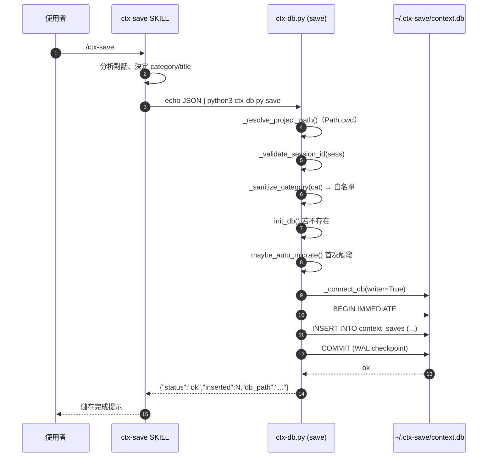
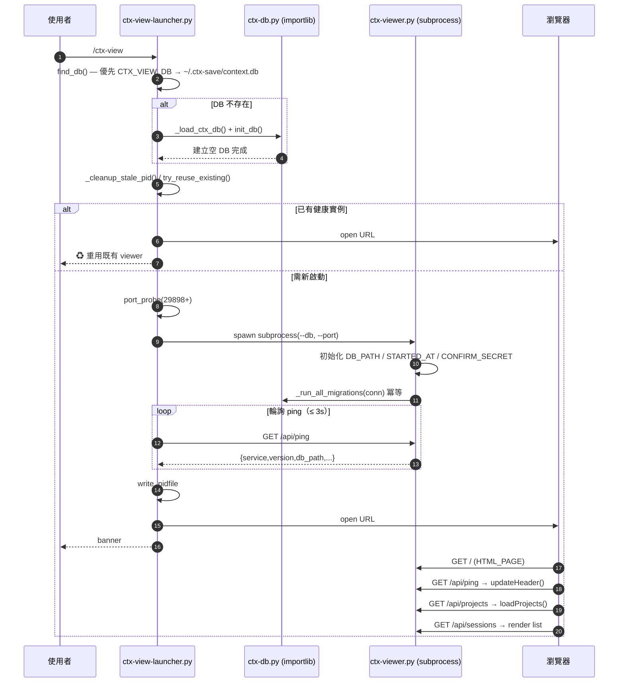
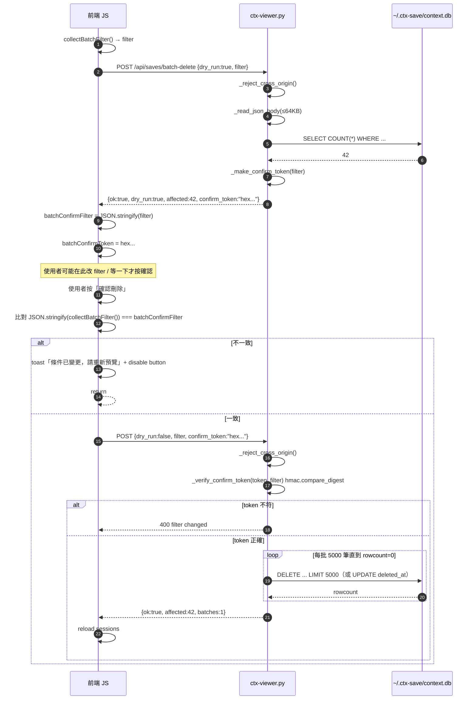

# 架構設計文件 — ctx-save 集中式 DB（v2.1）

- **Feature slug**: `centralized-db`
- **版本目標**: v2.1.0（升級自 v2.0.0 per-project DB）
- **技術棧**: Python 3.8+ 標準庫（`sqlite3`、`http.server`、`hmac`、`hashlib`、`subprocess`、`pathlib`、`importlib.util`）
- **依據**：spec.md v1.0、db.md v2.1
- **寫作日期**: 2026-04-18

---

## 1. 分層架構圖

### 1.1 整體分層（Mermaid flowchart）

```mermaid
flowchart LR
    subgraph CLI["CLI 層 — ctx-save SKILL.md"]
        direction TB
        CLI1["Claude 解析對話"]
        CLI2["決策 save / restore / list / search"]
        CLI3["shell out python3 ctx-db.py"]
        CLI1 --> CLI2 --> CLI3
    end

    subgraph DATA["資料層 — ctx-db.py（純函式模組）"]
        direction TB
        D1["_connect_db / _configure_connection"]
        D2["Schema：_init_schema + migrate_*"]
        D3["CRUD：save / list / get / search / clean / stats"]
        D4["Legacy 合併：migrate_legacy"]
        D5["白名單：_sanitize_category / _validate_session_id"]
    end

    subgraph LAUNCHER["啟動層 — ctx-view-launcher.py"]
        direction TB
        L1["find_db → init_db（若不存在）"]
        L2["_cleanup_stale_pid"]
        L3["port_probe（29898 起）"]
        L4["spawn ctx-viewer subprocess"]
        L5["wait_for_ping + open browser"]
    end

    subgraph WEB["Web 層 — ctx-viewer.py（BaseHTTPRequestHandler）"]
        direction TB
        W1["路由：9 個 HTTP 端點"]
        W2["CSRF：_reject_cross_origin"]
        W3["HMAC：_make/_verify_confirm_token"]
        W4["_read_json_body（64KB 上限）"]
        W5["OperationalError → 503"]
    end

    subgraph FE["前端層 — HTML/JS（嵌在 HTML_PAGE 字串）"]
        direction TB
        F1["Sidebar 專案下拉（/api/projects）"]
        F2["Header：DB 路徑 + 版本（/api/ping）"]
        F3["Session list / 詳情 / 搜尋"]
        F4["Batch delete：snapshot + token"]
        F5["XSS 防護：textContent / dataset"]
    end

    DB[(~/.ctx-save/context.db<br/>SQLite 單檔)]

    CLI3 -->|import sqlite3| DATA
    DATA -->|讀寫| DB
    LAUNCHER -->|importlib ctx-db| DATA
    LAUNCHER -->|spawn subprocess<br/>--db 路徑| WEB
    WEB -->|import sqlite3<br/>共用 _connect_db| DATA
    WEB -->|讀寫| DB
    WEB -->|HTTP JSON + HTML_PAGE| FE
    FE -->|fetch /api/*| WEB
```



### 1.2 層級職責與邊界

| 層 | 檔案 | 允許 | 禁止 |
|---|---|---|---|
| CLI | `ctx-save/SKILL.md` | 呼叫 shell、產生 JSON 餵給 `ctx-db.py` | 直接 import Python、直接碰 DB |
| 資料 | `ctx-save/scripts/ctx-db.py` | 所有 SQL、schema migration、路徑決策 | `import http.server`、組 HTML |
| 啟動 | `ctx-view/scripts/ctx-view-launcher.py` | port 探測、subprocess、PID file | 直接 `sqlite3.connect`、組 SQL（僅限呼叫 `ctx-db.init_db()`） |
| Web | `ctx-save/scripts/ctx-viewer.py` | HTTP 路由、CSRF、HMAC、JSON、HTML 字串 | 組 migration SQL（改呼叫 `ctx-db.migrate_*`） |
| 前端 | `HTML_PAGE` 字串內 JS | `fetch`、DOM 操作、`textContent`、`dataset` | `innerHTML` 接 user-supplied、`eval`、`onclick` 字串組 |

---

## 2. 類別 / 模組清單

### 2.1 `ctx-db.py`（資料層）

| 函式 / 常數 | 類型 | 簽章 | 職責 |
|---|---|---|---|
| `DB_NAME` | 修改 | `DB_NAME = "context.db"`（保留） | 沿用 |
| `DEFAULT_CENTRAL_DIR` | 新增 | `DEFAULT_CENTRAL_DIR = Path.home() / ".ctx-save"` | 中央目錄常數 |
| `CATEGORY_REGEX` | 新增 | `re.compile(r"^[a-z0-9_-]{1,32}$")` | 寫入白名單 |
| `SESSION_ID_REGEX` | 新增 | `re.compile(r"^[A-Za-z0-9_-]{1,64}$")` | CLI/API 驗證 |
| `MIGRATION_FLAG` | 新增 | `MIGRATION_FLAG = DEFAULT_CENTRAL_DIR / ".migration-done"` | auto-migrate 旗標 |
| `get_db_path` | 修改 | `get_db_path() -> Path` | 回 `CTX_SAVE_DB_PATH` 或 `~/.ctx-save/context.db`（移除 `project_root` 參數） |
| `_connect_db` | 新增 | `_connect_db(db_path: Path, writer: bool = False) -> sqlite3.Connection` | 建連線 + 套 PRAGMA；writer=True 立即 `BEGIN IMMEDIATE` |
| `_configure_connection` | 新增 | `_configure_connection(conn: sqlite3.Connection, writer: bool = False) -> None` | 套 WAL / synchronous=NORMAL / busy_timeout=5000 / foreign_keys=ON |
| `_init_schema` | 新增 | `_init_schema(conn: sqlite3.Connection) -> None` | `CREATE TABLE IF NOT EXISTS` + 6 組 `CREATE INDEX IF NOT EXISTS`（冪等） |
| `_run_all_migrations` | 新增 | `_run_all_migrations(conn) -> dict` | 依序呼叫 `migrate_add_deleted_at` → `migrate_add_project_path`，回報結果 |
| `init_db` | 修改 | `init_db(db_path: Optional[Path] = None) -> str` | 無參數時用 `get_db_path()`；保留舊簽章以利 `importlib` 呼叫 |
| `migrate_add_deleted_at` | 保留 | — | 既有，無變動 |
| `migrate_add_project_path` | 新增 | `migrate_add_project_path(conn) -> bool` | 冪等；欄位不存在才 `ALTER ADD COLUMN`；舊資料回填 `'(unknown)'` |
| `migrate_legacy` | 新增 | `migrate_legacy(central_db: Path, dry_run: bool = False) -> dict` | `rglob` 掃描 → `ATTACH` + `INSERT ... NOT EXISTS` 去重 → 改名；回 `{"ok","migrated","skipped","legacy_dbs","errors"}` |
| `maybe_auto_migrate` | 新增 | `maybe_auto_migrate() -> None` | 檢查 `.migration-done` + `CTX_SAVE_NO_MIGRATE`，首次讀指令觸發 |
| `_sanitize_category` | 新增 | `_sanitize_category(value: str) -> Tuple[str, Optional[str]]` | 白名單；不符回 `("custom", 原值)`；原值供上層附加到 content |
| `_validate_session_id` | 新增 | `_validate_session_id(value: str) -> bool` | 驗證 regex |
| `_resolve_project_path` | 新增 | `_resolve_project_path() -> str` | `CTX_PROJECT` 或 `Path.cwd().resolve()`；統一轉 POSIX |
| `save` | 修改 | `save(db_path: Path, records: list) -> None` | 套 `_sanitize_category` + 強制 `project_path` NOT NULL + `_connect_db(writer=True)` |
| `list_sessions` | 修改 | `list_sessions(db_path, project_path=None, limit=20)` | 加 `LIMIT ≤ 500` 檢查 |
| `get_session` | 修改 | `get_session(db_path, session_id)` | 先 `_validate_session_id`，不符拋 ValueError |
| `search` | 修改 | `search(db_path, keyword, project_path=None)` | keyword 長度檢查 ≤ 200 |
| `list_projects` | 新增 | `list_projects(db_path: Path) -> list[dict]` | `SELECT DISTINCT project_path, COUNT(*), COUNT(DISTINCT session_id), MAX(created_at) ... GROUP BY project_path` |
| `stats` | 修改 | `stats(db_path)` | 加 `by_project` 聚合欄位 |
| `clean` | 保留 | — | 不變 |
| `_cli_migrate_legacy` | 新增 | `_cli_migrate_legacy(args) -> int` | 新子指令 `migrate-legacy` 的 entry |

### 2.2 `ctx-viewer.py`（Web + 前端層）

#### 2.2.1 模組級常數

| 名稱 | 類型 | 值 | 職責 |
|---|---|---|---|
| `DB_PATH` | 修改 | 預設來自 `CTX_SAVE_DB_PATH` 或 `~/.ctx-save/context.db` | viewer 啟動時決定 |
| `SERVICE_NAME` | 保留 | `"ctx-viewer"` | launcher 身份比對 |
| `VERSION` | 修改 | `"2.1.0"` | ping 回傳 + header 顯示 |
| `STARTED_AT` | 新增 | ISO8601 UTC 字串 | HMAC token 計算基準 |
| `CONFIRM_SECRET` | 新增 | `secrets.token_bytes(32)` | HMAC key（程序啟動時一次） |
| `ALLOWED_ORIGINS` | 新增 | `{"127.0.0.1", "localhost"}` | CSRF 白名單 |
| `MAX_BODY_BYTES` | 新增 | `65536` | POST 大小上限 |
| `MAX_SEARCH_LEN` | 新增 | `200` | keyword 上限 |
| `BATCH_SIZE` | 新增 | `5000` | 批次刪除分段 |

#### 2.2.2 Handler 輔助函式（`ContextHandler` 新增方法）

| 方法 | 類型 | 簽章 | 職責 |
|---|---|---|---|
| `_reject_cross_origin` | 新增 | `_reject_cross_origin(self) -> bool` | 檢查 `Origin` > `Referer`；不合法寫 403 後回 True |
| `_host_from` | 新增 | `_host_from(self, url: str) -> Optional[str]` | `urlparse` 取 hostname |
| `_read_json_body` | 新增 | `_read_json_body(self, max_bytes: int = MAX_BODY_BYTES) -> Optional[dict]` | 檢查 `Content-Length`、parse JSON；失敗寫 400/413 後回 None |
| `_canonical_filter` | 新增 | `_canonical_filter(filter_dict: dict) -> str` | `json.dumps(sort_keys=True, separators=(",", ":"))` |
| `_make_confirm_token` | 新增 | `_make_confirm_token(filter_dict: dict) -> str` | `hmac.new(CONFIRM_SECRET, canonical+\|+STARTED_AT, sha256).hexdigest()` |
| `_verify_confirm_token` | 新增 | `_verify_confirm_token(token: str, filter_dict: dict) -> bool` | `hmac.compare_digest` |
| `_json_response` | 新增 | `_json_response(self, status: int, payload: dict) -> None` | 統一 JSON 回應寫法 |
| `_wrap_operational_error` | 新增 | `_wrap_operational_error(self, exc) -> None` | log 細節 + 回 `503 db busy or readonly` |
| `get_db` | 修改 | `get_db(self, writer=False)` | 改呼叫 `ctx_db._connect_db(DB_PATH, writer=writer)` |

#### 2.2.3 路由處理器

| 方法 | 類型 | 路由 | 職責 |
|---|---|---|---|
| `do_GET` | 修改 | — | 新增 `/api/projects`；`/api/ping` 擴欄；sessions/search 加 `project_path` filter |
| `do_POST` | 新增 | — | 路由到 `_handle_batch_delete` |
| `do_DELETE` | 修改 | — | 加 `_reject_cross_origin` 前處理 |
| `_handle_ping` | 修改 | GET `/api/ping` | 加 `db_path / project_count / record_count / started_at` |
| `_handle_sessions` | 修改 | GET `/api/sessions` | `project_path` query + `LIMIT ≤ 500` |
| `_handle_session_detail` | 修改 | GET `/api/session/<id>` | `_validate_session_id`；不符 400 |
| `_handle_search` | 修改 | GET `/api/search` | keyword ≤ 200；加 project_path filter |
| `_handle_stats` | 修改 | GET `/api/stats` | 加 `by_project` |
| `_handle_projects` | 新增 | GET `/api/projects` | 呼叫 `ctx_db.list_projects` |
| `_handle_delete_save` | 修改 | DELETE `/api/saves/<id>` | CSRF 檢查前置 |
| `_handle_delete_session` | 修改 | DELETE `/api/session/<id>` | CSRF + session_id 驗證 |
| `_handle_batch_delete` | 新增 | POST `/api/saves/batch-delete` | CSRF → body → token → 分段 delete |
| `_delete_with_fallback` | 新增 | 輔助 | 5000 筆分段（硬刪失敗落回軟刪） |

#### 2.2.4 前端 JS（嵌在 `HTML_PAGE` 字串）

| 函式 / 變數 | 類型 | 職責 |
|---|---|---|
| `escapeHtml` | 修改 | 加入單引號逸出 `&#39;` |
| `escapeJs` | 新增 | `JSON.stringify` 包裝，避免 JS 字面值注入 |
| `renderSessionRow` | 修改 | 移除 `onclick` 字串組；改 `addEventListener` + `dataset.sessionId` |
| `renderCategory` | 修改 | label 改 `textContent` |
| `batchConfirmFilter` | 新增 | 全域變數：preview 時的 filter snapshot（JSON string） |
| `batchConfirmToken` | 新增 | 全域變數：preview 回傳的 HMAC token |
| `previewBatchDelete` | 修改 | dry_run POST；成功後 `batchConfirmFilter = JSON.stringify(filter)` |
| `confirmBatchDelete` | 修改 | 比對 `JSON.stringify(collectBatchFilter()) === batchConfirmFilter`；不一致 reset 並提示重新預覽 |
| `loadProjects` | 新增 | 抓 `/api/projects` 填 sidebar 下拉；`textContent` 設 label |
| `updateHeader` | 新增 | 從 `/api/ping` 抓 `db_path` / `version` 寫入 header |
| `applyProjectFilter` | 新增 | 下拉 change 時重新呼叫 `/api/sessions?project_path=...` |

### 2.3 `ctx-view-launcher.py`（啟動層）

| 函式 | 類型 | 簽章 | 職責 |
|---|---|---|---|
| `DB_RELATIVE` | 移除 | — | 不再需要從 cwd 往上找 |
| `CTX_SAVE_DIR` | 新增 | `CTX_SAVE_DIR = Path.home() / ".ctx-save"` | 中央目錄常數 |
| `_load_ctx_db` | 新增 | `_load_ctx_db() -> ModuleType` | `importlib.util.spec_from_file_location("ctx_db", "<path>/ctx-db.py")` 動態載入（檔名含 dash） |
| `find_db` | 修改 | `find_db() -> Path` | 優先 `CTX_VIEW_DB` → `CTX_SAVE_DB_PATH` → `~/.ctx-save/context.db`；不存在則呼叫 `ctx_db.init_db()` 建立空 DB |
| `_cleanup_stale_pid` | 新增 | `_cleanup_stale_pid() -> None` | 與 `try_reuse_existing` 整合；PID file 殘留但 process 已死時清除（已部分在 `try_reuse_existing`，此為強化） |
| `try_reuse_existing` | 修改 | — | 清理邏輯更嚴；複用時比對 `db_path` 是否相同 |
| `spawn_viewer` | 保留 | — | 傳 `--db` 為中央路徑字串 |
| `_print_banner` | 修改 | — | 顯示 `DB: ~/.ctx-save/context.db`（使用 home-relative 美化） |

---

## 3. 介面定義

### 3.1 跨模組契約

| 介面 | 呼叫方 | 被呼叫方 | 形式 |
|---|---|---|---|
| `ctx_db.init_db()` | `ctx-view-launcher.py` | `ctx-db.py` | `importlib` 動態載入 + `init_db()` 無參數呼叫 |
| `ctx_db._connect_db(path, writer)` | `ctx-viewer.py` / `ctx-db.py` CLI | `ctx-db.py` | 所有 writer 操作必 `writer=True`（`BEGIN IMMEDIATE`） |
| `ctx_db.migrate_add_project_path(conn)` | `ctx-viewer.py` 啟動時 | `ctx-db.py` | 冪等；viewer 連到舊 DB 也自動升級 |
| `ctx_db.list_projects(db)` | `ctx-viewer.py: _handle_projects` | `ctx-db.py` | 回 `list[dict]`，由 Web 層 serialize |
| `/api/ping` | launcher / 前端 | viewer | `{"ok","service","version","db_path","project_count","record_count","started_at"}` |
| `--db` CLI 參數 | launcher | viewer | viewer 啟動時寫入 `DB_PATH` 全域變數 |

### 3.2 SQLite 連線使用規約

| 場景 | 寫法 |
|---|---|
| 讀取 | `with ctx_db._connect_db(path) as conn: ...`（reader，不 BEGIN IMMEDIATE） |
| 寫入 | `with ctx_db._connect_db(path, writer=True) as conn: ...`（自動 `BEGIN IMMEDIATE`） |
| Migration | 必 `writer=True`；冪等設計允許重複執行 |
| 批次刪除 | `writer=True`；外層 Python loop 控制 5000 筆一批 |

### 3.3 Migration 回傳 schema

```python
{
    "ok": bool,                         # 整體成功/失敗
    "migrated_files": int,              # 成功合併的 legacy DB 數
    "total_inserted": int,              # 新增進中央 DB 的列數
    "skipped_duplicate": int,           # 因 (session_id, created_at, title) 碰撞而跳過
    "legacy_dbs": list[str],            # 本次掃描到的 legacy DB 絕對路徑
    "renamed": list[str],               # 改名為 .migrated-YYYYMMDD 的新檔名
    "errors": list[{"path": str, "error": str}],  # 單檔失敗列表
}
```

### 3.4 HTTP 回傳 envelope

- 成功：`{"ok": true, ...業務欄位}` 或僅業務欄位（維持既有格式）
- 失敗：`{"ok": false, "error": "人類可讀訊息"}`
- Status code 與 spec §4 錯誤處理策略一致

---

## 4. 設計模式選擇

| 模式 | 套用位置 | 理由 |
|---|---|---|
| **Template Method** | `ContextHandler` 的 `do_POST` / `do_DELETE` 共用前處理（CSRF → body → 路由 → OperationalError 轉譯） | 所有寫操作必經相同驗證鏈 |
| **Strategy** | `ctx-db.py` 的查詢分支：`list_sessions` / `search` / `get_session` / `list_projects` | 共用 `_connect_db` 連線管理，查詢邏輯分歧 |
| **Migration Chain** | `_run_all_migrations` 串接 `migrate_add_deleted_at` → `migrate_add_project_path` | 冪等 + 漸進式；未來再加新 migration 只需追加一環 |
| **Singleton-by-env** | `DB_PATH` / `CONFIRM_SECRET` / `STARTED_AT` 程序啟動時決定 | HMAC key 必須恆定；DB 路徑不能中途換（否則已打開的 connection 失效） |
| **Factory Method** | `_connect_db(writer=...)` 依 role 回傳不同行為的 connection | 寫端額外 `BEGIN IMMEDIATE`，讀端不 block |
| **Guard Clause** | `_reject_cross_origin` / `_validate_session_id` / `_read_json_body` 失敗時直接寫 response 並回 `None` / `True`，caller 早退 | 扁平化控制流，避免巢狀 if |
| **Snapshot** | 前端 `batchConfirmFilter` 快照 + HMAC token 雙重驗證 | 防 preview → confirm 之間 filter 被改動 |

---

## 5. 資料流（Sequence Diagram）

### 5.1 CLI 儲存流程（`/ctx-save` → `ctx-db.py save`）



### 5.2 Viewer 啟動流程（`/ctx-view` → launcher → viewer）



### 5.3 Batch Delete 流程（前端 preview → confirm）



---

## 6. 安全機制設計

### 6.1 CSRF（Origin / Referer）

| 項目 | 細節 |
|---|---|
| 白名單 | `{"127.0.0.1", "localhost"}` 僅 hostname，不限 port（因 port 動態） |
| 優先級 | `Origin` header 有值 → 驗 Origin；否則驗 `Referer`；兩者都無 → 403 |
| 套用路由 | 所有 `DELETE /api/*` 與 `POST /api/*` |
| 回應 | 403 `{"ok":false,"error":"cross-origin request blocked"}` |
| Log | `WARN cross-origin from {origin}` |

### 6.2 HMAC `confirm_token`（batch-delete 二次確認）

```python
# viewer 啟動時一次：
CONFIRM_SECRET: bytes = secrets.token_bytes(32)
STARTED_AT: str = datetime.utcnow().isoformat() + "Z"

def _make_confirm_token(filter_dict: dict) -> str:
    canonical = json.dumps(filter_dict, sort_keys=True,
                           separators=(",", ":"))
    msg = f"{canonical}|{STARTED_AT}".encode("utf-8")
    return hmac.new(CONFIRM_SECRET, msg, hashlib.sha256).hexdigest()

def _verify_confirm_token(token: str, filter_dict: dict) -> bool:
    expected = _make_confirm_token(filter_dict)
    return hmac.compare_digest(token, expected)
```

- **Key 來源**：`secrets.token_bytes(32)`（每次啟動重生，重啟 viewer 舊 token 自然失效）
- **Salt**：`STARTED_AT`（二層保險）
- **比對**：`hmac.compare_digest`（避免 timing attack）
- **過期**：不設 TTL；重啟 viewer 即失效（配合 snapshot 機制足夠）

### 6.3 XSS 防護

| 層 | 手段 |
|---|---|
| 後端寫入 | `_sanitize_category`（白名單 regex）；非法改 `custom`；原值保留於 `content` 前綴 |
| 後端回應 | JSON serialize 自動 escape；不組 HTML |
| 前端 DOM | 所有 DB 值用 `textContent`（不用 `innerHTML`） |
| 前端事件 | 改 `addEventListener` + `dataset.*`，**禁止** `onclick="fn('${value}')"` |
| 前端 JS 字面 | 插入 JS 值時用 `JSON.stringify` 包裝（`escapeJs` helper） |
| `escapeHtml` | 保留但加入單引號 `&#39;` |

### 6.4 DoS 防護

| 項目 | 值 | 實作位置 |
|---|---|---|
| POST body 上限 | 64 KiB | `_read_json_body` 檢查 `Content-Length` header |
| search keyword 上限 | 200 字元 | `_handle_search` 檢查 |
| `/api/sessions` 結果上限 | LIMIT 500 | SQL 層 + `limit` query param 驗證 ≤ 500 |
| batch delete 單批 | 5000 筆 | `_delete_with_fallback` for-loop |
| session_id 長度 | 64 | `SESSION_ID_REGEX` |
| category 長度 | 32 | `CATEGORY_REGEX` |

### 6.5 資訊洩漏防護

| 場景 | 對外回應 | Log |
|---|---|---|
| `sqlite3.OperationalError` | 503 `{"ok":false,"error":"db busy or readonly"}` | 完整 exception（`ERROR OperationalError: ...`） |
| `json.JSONDecodeError` | 400 `{"ok":false,"error":"invalid JSON"}` | 只 log 第一行 |
| 其他 `Exception` | 500 `{"ok":false,"error":"internal error"}` | 完整 traceback |
| CSRF 拒絕 | 403 固定訊息 | `WARN cross-origin from {origin}` |

---

## 7. 跨平台注意事項

### 7.1 路徑處理

| 議題 | 決策 |
|---|---|
| `project_path` 儲存格式 | 統一 POSIX（`/Users/cheng/xxx`）；Windows 透過 `PurePosixPath(Path.cwd().resolve().as_posix())` |
| `~/.ctx-save/` 實際位置 | macOS/Linux: `$HOME/.ctx-save/`；Windows: `C:\Users\<user>\.ctx-save\` |
| Home-relative 顯示 | Header 顯示時用 `str(path).replace(str(Path.home()), "~")` 美化 |
| 路徑比對 | API `project_path=?` 用 exact match；客戶端傳入時需以相同規則 normalize |

### 7.2 Python 版本

- 最低 **Python 3.8**（`sqlite3` 標準庫在 3.8 已成熟）
- **禁止使用**：3.10+ `match` 語法、`|` union type hint（改 `Union[X, Y]`）、`list[int]` 參數化（改 `List[int]`）
- `secrets.token_bytes` 自 3.6 即可用
- `hmac.compare_digest` 自 3.3 即可用
- `importlib.util.spec_from_file_location` 可處理檔名含 dash（`ctx-db.py`）

### 7.3 SQLite 版本

- 最低 3.31（macOS/Linux 內建 Python 3.8 通常 ≥ 3.32）
- 不使用 3.35+ 的 `ALTER TABLE DROP COLUMN`（rollback 章節提供手動重建方案）
- 不使用 `GENERATED COLUMN`
- WAL 在 NTFS / APFS / ext4 皆支援

### 7.4 PID file 與 process 檢測

| 平台 | 手段 |
|---|---|
| macOS / Linux | `os.kill(pid, 0)` 檢測存活 |
| Windows | `pidfile.is_alive` 已存在（詳細看 `lib/pidfile.py`）；注意 signal 模型不同 |
| `start_new_session=True` | POSIX 專屬；Windows 走預設 detach 即可 |

---

## 8. 目錄結構（檔案變動對照 spec §10）

```
plugins/ctx-save/
├── .gitignore                          # 新增：排除 .ctx-save/ 殘留檔
├── skills/
│   ├── ctx-save/
│   │   ├── SKILL.md                    # 修改：新增 CTX_SAVE_DB_PATH / migrate-legacy 指令說明
│   │   ├── references/
│   │   │   └── storage-schema.md       # 修改：schema 新增 project_path 欄位
│   │   └── scripts/
│   │       ├── ctx-alert.sh            # 不變
│   │       ├── ctx-db.py               # 修改（大量）：集中化 + migration + 白名單
│   │       └── ctx-viewer.py           # 修改（大量）：9 API + CSRF + HMAC + 前端改寫
│   ├── ctx-view/
│   │   ├── SKILL.md                    # 檢視：確認仍 shell out launcher
│   │   └── scripts/
│   │       ├── ctx-view-launcher.py    # 修改：stale PID 清理 + importlib + find_db 改集中
│   │       └── lib/
│   │           ├── pidfile.py          # 不變
│   │           └── port_probe.py       # 不變
│   └── ctx-view-stop/                  # 不變
└── (新增)                              # .ctx-save/ 執行時動態產生於 ~/，repo 不含
```

### 8.1 不變動的檔案

- `ctx-alert.sh`、`lib/pidfile.py`、`lib/port_probe.py`、`ctx-view-stop/*`
- 既有 `migrate_add_deleted_at` 函式（保留以利舊 DB 相容）

### 8.2 修改的檔案

- `ctx-save/scripts/ctx-db.py` — 大量改動（新增 10+ 函式）
- `ctx-save/scripts/ctx-viewer.py` — 大量改動（後端新增 10+ 方法、前端重寫 session render / batch delete / sidebar）
- `ctx-view/scripts/ctx-view-launcher.py` — 中等改動（DB 定位邏輯重寫）
- `ctx-save/SKILL.md` — 文件更新
- `ctx-save/references/storage-schema.md` — 文件更新

### 8.3 新增的檔案

- `plugins/ctx-save/.gitignore`（僅一行：`.ctx-save/`）

---

## 9. 與其他模組的依賴

### 9.1 Skill 間依賴

| 關係 | 細節 |
|---|---|
| `ctx-save` SKILL → `ctx-db.py` | shell out（`python3 <path>/ctx-db.py save`） |
| `ctx-view` SKILL → `ctx-view-launcher.py` | shell out，無變動 |
| `ctx-view-launcher.py` → `ctx-db.py` | `importlib.util.spec_from_file_location` 動態載入（檔名含 dash） |
| `ctx-view-launcher.py` → `ctx-viewer.py` | `subprocess.Popen` 背景啟動，僅透過 `--db` / `--port` CLI 參數與 `/api/ping` 介面 |
| `ctx-viewer.py` → `ctx-db.py` | 相同 dir，可用 `importlib` 或相對 path 載入；主要用 `_connect_db`、`migrate_*`、`list_projects` |
| `ctx-view-stop` | 不受影響 |

### 9.2 文件 / 配置依賴

| 檔案 | 變動 |
|---|---|
| `ctx-save/SKILL.md` | 新增段落：「DB 路徑：`~/.ctx-save/context.db`（可用 `CTX_SAVE_DB_PATH` 覆寫）」、「Migration：`python3 ctx-db.py migrate-legacy`」、「環境變數：`CTX_SAVE_DB_PATH` / `CTX_SAVE_NO_MIGRATE` / `CTX_VIEW_DB`」 |
| `ctx-save/references/storage-schema.md` | Schema 表格新增 `project_path`（NOT NULL）、`idx_saves_project_created` 複合索引 |
| `plugins/ctx-save/.gitignore` | 新增 `.ctx-save/` 避免 viewer.log / pidfile 誤 commit |

### 9.3 環境變數一覽

| 變數 | 作用層 | 預設 | 覆寫時機 |
|---|---|---|---|
| `CTX_SAVE_DB_PATH` | `ctx-db.py` | `~/.ctx-save/context.db` | CI / 測試 / 多使用者切換 |
| `CTX_SAVE_NO_MIGRATE` | `ctx-db.py` CLI | unset | 不想合併舊資料 |
| `CTX_PROJECT` | `ctx-db.py save` | `Path.cwd()` | 用 subprocess 代跑時固定 project |
| `CTX_VIEW_DB` | `ctx-view-launcher.py` | 跟隨 `CTX_SAVE_DB_PATH` | launcher 特定測試 |
| `CTX_VIEW_PORT` | launcher | 29898 | port 衝突時 |
| `CTX_VIEW_NO_OPEN` | launcher | unset | headless / CI 不開瀏覽器 |

---

## 10. 實作注意點與風險

### 10.1 importlib 動態載入（檔名含 dash）

```python
import importlib.util
from pathlib import Path

def _load_ctx_db():
    here = Path(__file__).resolve().parent
    ctx_db_path = here.parent.parent / "ctx-save" / "scripts" / "ctx-db.py"
    spec = importlib.util.spec_from_file_location("ctx_db", ctx_db_path)
    module = importlib.util.module_from_spec(spec)
    spec.loader.exec_module(module)
    return module
```

> 因檔名為 `ctx-db.py`（dash），不能用 `import ctx_db`，必須 `importlib`。

### 10.2 HMAC Key 重啟後失效

- 前端在 viewer 重啟後若仍握著舊 token，`confirm_token` 會比對失敗 → 回 400 `filter changed`
- 這是期望行為（重啟 = 全新 session）；前端收到 400 會自動要求重新預覽

### 10.3 Batch delete 硬刪 / 軟刪 fallback

- 預設硬刪（`DELETE`）；若遇到 foreign key constraint（目前無 FK，但預留）或外部鎖 → 落回軟刪（`UPDATE SET deleted_at=...`）
- 回傳 `mode: "hard" | "soft"` 告知前端實際執行方式

### 10.4 Legacy migration Ctrl+C 安全性

- `.migration-done` 旗標在「**全部**完成後」才寫入
- 中途中斷：已改名的 legacy 檔已排除在下次 glob 之外（安全）；未改名的重跑時會重複 `INSERT ... NOT EXISTS`（去重邏輯保護）

### 10.5 DB 首次建立 vs Viewer 啟動競爭

- Launcher 先檢查 DB 存在性 → 不存在 → 呼叫 `init_db` → 再 spawn viewer
- 避免 viewer 啟動時併發 `CREATE TABLE` 造成 `database is locked`
- `init_db` 本身冪等（`CREATE TABLE IF NOT EXISTS`），重複呼叫無副作用

---

## 11. 驗收對應（與 spec §8 對照）

| 驗收項 | 架構設計對應 |
|---|---|
| 多專案資料都進中央 DB | §2.1 `get_db_path` 集中化 + `save` 強制 `project_path` |
| Viewer header 顯示 DB 路徑 + 版本 | §2.2.4 `updateHeader` 從 `/api/ping` 取 `db_path` + `version` |
| Sidebar 專案下拉 | §2.2.3 `_handle_projects` + §2.2.4 `loadProjects` / `applyProjectFilter` |
| Legacy 遷移腳本 | §2.1 `migrate_legacy` + §3.3 回傳 schema + §5 sequence 未含但 §10.4 有流程 |
| CSRF 403 | §6.1 `_reject_cross_origin` |
| XSS 不執行 | §6.3 前端 `textContent` + `dataset` + 後端白名單 |

---

## 12. 文件產出記錄

- arch.md 行數：約 560 行（完成後以 `wc -l` 覆核）
- Mermaid 圖數量：**4 張**
  1. §1.1 整體分層 flowchart
  2. §5.1 CLI 儲存 sequenceDiagram
  3. §5.2 Viewer 啟動 sequenceDiagram
  4. §5.3 Batch delete sequenceDiagram
- 表格數量：20+（分層、類別清單、模式、索引、環境變數、驗收對照等）

---

**結語**：本設計遵循 spec.md 定義的 5 層邊界（CLI / 資料 / 啟動 / Web / 前端）與 db.md 的 schema 決策，以最小破壞方式升級 v2.0 → v2.1。關鍵改動集中於 `ctx-db.py`（新增 10+ 函式）與 `ctx-viewer.py`（後端 handler + 前端 JS），`ctx-view-launcher.py` 僅調整 DB 定位邏輯。向後相容性由 migration chain（`migrate_add_deleted_at` → `migrate_add_project_path`）與冪等 `CREATE INDEX IF NOT EXISTS` 保證。
