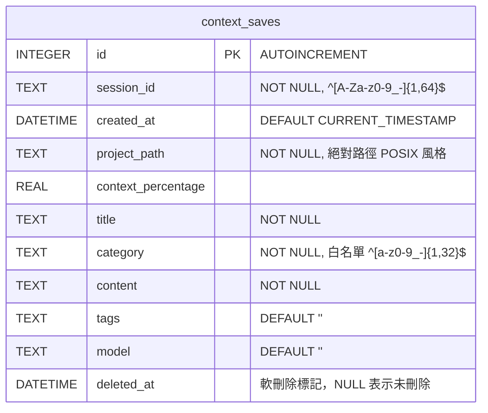
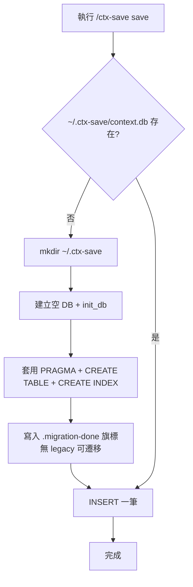
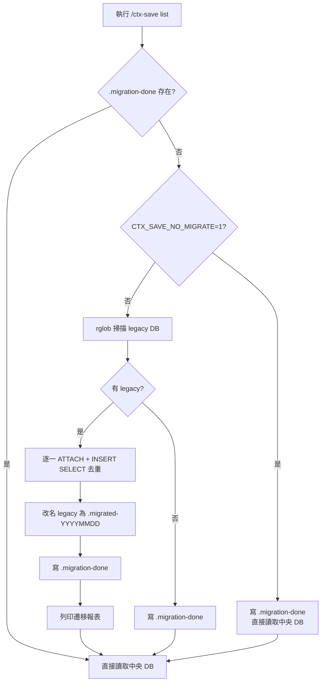

# DB 設計文件 — ctx-save 集中式 DB（v2.1）

- **Feature slug**: `centralized-db`
- **版本目標**: v2.1.0（升級自 v2.0.0 per-project DB）
- **資料庫引擎**: SQLite 3.31+
- **主要異動**: `context_saves` 表新增 `project_path` 欄位 + 1 組複合索引；新增 legacy DB 遷移腳本

---

## 1. 資料庫總覽

### 1.1 資料庫位置

| 項目 | 值 |
|---|---|
| 預設路徑 | `~/.ctx-save/context.db` |
| 覆寫環境變數 | `CTX_SAVE_DB_PATH`（優先度最高；支援 `~` 展開；建議用絕對路徑） |
| Viewer 覆寫 | `CTX_VIEW_DB`（若未設定則跟隨 `CTX_SAVE_DB_PATH`） |
| 父目錄策略 | 不存在時以 `mkdir(parents=True, exist_ok=True)` 建立 |
| 解析邏輯 | `Path(os.environ.get("CTX_SAVE_DB_PATH", "~/.ctx-save/context.db")).expanduser().resolve()` |

> **為何集中化**：前代 v2.0 採「每專案一個 DB」（`{project}/.ctx-save/context.db`），造成跨專案查詢困難、session 碎片化、viewer 無從識別當前 DB。v2.1 統一寫入 `~/.ctx-save/context.db`，以 `project_path` 欄位區分來源專案。

### 1.2 環境需求

| 項目 | 最低版本 | 說明 |
|---|---|---|
| SQLite | 3.31+ | 支援 `ATTACH DATABASE` 跨庫 INSERT、WAL、`PRAGMA table_info`；本規格不使用 `GENERATED COLUMN`，故不強依賴 3.31，但推薦版本一致 |
| Python | 3.8+ | `sqlite3` 標準庫；`pathlib.Path.rglob` 掃描 legacy DB |
| 檔案系統 | 支援 flock / POSIX 鎖 | WAL 模式需求；macOS/Linux/Windows NTFS 皆符合 |

### 1.3 ER 圖



> 整體僅一張表，以下以欄位、索引、遷移、PRAGMA 等分項說明。

---

## 2. PRAGMA 設定（所有連線必套用）

所有連線（CLI 寫入、viewer 讀寫、migration、測試）在 `connect()` 之後立刻套用：

```python
conn.execute("PRAGMA journal_mode = WAL")      # 讀寫並發
conn.execute("PRAGMA synchronous = NORMAL")    # 效能取向，WAL 下仍安全
conn.execute("PRAGMA busy_timeout = 5000")     # 5 秒內等鎖，避免立即 OperationalError
conn.execute("PRAGMA foreign_keys = ON")       # 目前無 FK，預留給後續 schema
```

| PRAGMA | 值 | 理由 |
|---|---|---|
| `journal_mode` | `WAL` | 讓讀寫並發，viewer 讀取不阻塞 CLI 寫入 |
| `synchronous` | `NORMAL` | WAL 下搭配 `NORMAL` 效能最佳，斷電時最多丟失最後一筆交易 |
| `busy_timeout` | `5000`（毫秒） | 搭配 viewer 的 `BEGIN IMMEDIATE`，避免瞬間競爭造成 `database is locked` |
| `foreign_keys` | `ON` | 目前表無 FK，但預留；避免未來忘了開 |

寫端另需使用 `BEGIN IMMEDIATE`（非 `BEGIN`），以便立即取得 write lock，避免 reader 升級成 writer 時才發現衝突。

---

## 3. 資料表定義：`context_saves`

### 3.1 欄位清單

| 欄位 | 型別 | 可空 | 預設 | 說明 |
|---|---|---|---|---|
| `id` | `INTEGER` | NO | `AUTOINCREMENT` | 主鍵，自增；不得重用已刪 ID |
| `session_id` | `TEXT` | NO | — | Claude Code session ID；應用層驗證 `^[A-Za-z0-9_-]{1,64}$` |
| `created_at` | `DATETIME` | NO | `CURRENT_TIMESTAMP` | 建檔時間（UTC，SQLite 預設） |
| `project_path` | `TEXT` | **NO**（v2.1 新增，舊資料回填） | — | `Path.cwd().resolve()` 絕對路徑；跨平台一律 POSIX 風格（Windows 存 `/Users/.../xxx`） |
| `context_percentage` | `REAL` | YES | NULL | 儲存當下 context window 使用率（0.0–1.0） |
| `title` | `TEXT` | NO | — | 筆記標題 |
| `category` | `TEXT` | NO | — | 分類；寫入時白名單 `^[a-z0-9_-]{1,32}$`，不符改為 `custom` |
| `content` | `TEXT` | NO | — | 筆記內容（Markdown） |
| `tags` | `TEXT` | YES | `''` | 逗號分隔的標籤 |
| `model` | `TEXT` | YES | `''` | Claude 模型名稱（如 `claude-opus-4-7`） |
| `deleted_at` | `DATETIME` | YES | NULL | 軟刪除時間戳；NULL 表示未刪除 |

### 3.2 `project_path` 使用規約

| 規約 | 說明 |
|---|---|
| 來源 | `Path.cwd().resolve()`；可被 `CTX_PROJECT` 環境變數覆寫 |
| NOT NULL | v2.1 後新資料強制帶入；舊資料在 migration 時以 legacy DB 父目錄（`.ctx-save` 的 parent）回填 |
| 路徑風格 | 一律 POSIX（`/Users/cheng/xxx`）；Windows 以 `pathlib.PurePosixPath` 轉換 |
| 顯示 | `NULL` 或空字串在 viewer 顯示為 `"(unknown)"`（僅遷移失敗的極端情形） |
| 比對 | API 查詢採 exact match（`project_path = ?`），不做模糊前綴比對 |

### 3.3 `category` 白名單

- **寫入時**：`re.match(r"^[a-z0-9_-]{1,32}$", category)` 不符則改為 `"custom"`，原值保留在 `content` 前綴 `[原 category: xxx]\n`。
- **讀取時**：原樣回傳（不改寫舊資料，保留 `postgresql-tuning`、`MSSQL_IndexDesign` 等舊值）。
- **DB 層**：不加 CHECK constraint（避免 ALTER TABLE 複雜化 + 相容舊 DB）；驗證完全在應用層。

---

## 4. 索引設計

### 4.1 索引清單

| 索引名 | 欄位 | 用途 | v2.1 狀態 |
|---|---|---|---|
| `idx_saves_session` | `session_id` | `/api/session/<id>`、批次刪除 session 對照 | 保留 |
| `idx_saves_project` | `project_path` | `/api/projects` 的 `GROUP BY project_path`、DISTINCT project_path | 保留 |
| `idx_saves_created` | `created_at DESC` | 時序排序、主列表預設排序 | 保留 |
| `idx_saves_category` | `category` | `/api/stats` 分類統計、批次刪除 filter | 保留 |
| `idx_saves_deleted` | `deleted_at` | 過濾軟刪除 / 未刪除 | 保留 |
| `idx_saves_project_created` | `project_path, created_at DESC` | **新增**：`/api/sessions?project_path=X` 最主力查詢、sidebar 過濾 | **新增** |

### 4.2 設計理由

- `idx_saves_project_created`（複合）— 支援「指定專案 + 最新 session 在前」這個 sidebar 下拉最常見的查詢；`ORDER BY MIN(created_at) DESC` 時可利用最左前綴 `project_path` 命中索引後 skip scan。
- `idx_saves_project`（單欄）**保留不刪**：`/api/projects` 的 `SELECT DISTINCT project_path, COUNT(*) FROM ... GROUP BY project_path` 只用到 `project_path` 單欄，單欄索引比複合索引更小、掃描更快；保留它不衝突複合索引。
- `idx_saves_deleted` — 雖選擇性低（多數為 NULL），但 `WHERE deleted_at IS NULL` 是所有查詢的標配，SQLite optimizer 可利用它直接取得未刪除資料。
- **不建複合**：`(deleted_at, project_path)` — 因 `deleted_at IS NULL` 選擇性太低，加進去會讓索引變肥且 reorganize 成本高。

### 4.3 最左前綴示例

```sql
-- ✅ 可命中 idx_saves_project_created
SELECT * FROM context_saves
 WHERE project_path = '/Users/cheng/IdeaProjects/Taipei/LineBC'
   AND deleted_at IS NULL
 ORDER BY created_at DESC
 LIMIT 500;

-- ⚠ 僅命中 idx_saves_created（因 project_path 未帶）
SELECT * FROM context_saves
 WHERE deleted_at IS NULL
 ORDER BY created_at DESC
 LIMIT 500;
```

---

## 5. Migration 腳本設計

### 5.1 Schema 遷移（冪等）

#### 5.1.1 `migrate_add_project_path`

```python
def migrate_add_project_path(conn):
    cols = [r[1] for r in conn.execute("PRAGMA table_info(context_saves)").fetchall()]
    if "project_path" not in cols:
        # SQLite 不支援 NOT NULL 無預設的 ALTER ADD，先加允許 NULL，回填後再強制
        conn.execute("ALTER TABLE context_saves ADD COLUMN project_path TEXT")
        # 舊資料無法精確回填 → 預設 '(unknown)'，等使用者執行 migrate-legacy 再補正
        conn.execute("UPDATE context_saves SET project_path = '(unknown)' WHERE project_path IS NULL")
```

> SQLite 的 `ALTER TABLE ADD COLUMN` 不支援「NOT NULL 且無預設」的寫法。做法：先加 nullable → 回填預設 → 在應用層強制 insert 時必帶。

#### 5.1.2 新增索引（冪等）

全部以 `CREATE INDEX IF NOT EXISTS` 寫法，重複呼叫不出錯。

### 5.2 Legacy DB 遷移（`ctx-db.py migrate-legacy`）

#### 5.2.1 掃描策略

| 步驟 | 邏輯 |
|---|---|
| 1 | `Path.home().rglob(".ctx-save/context.db")` 遞迴掃描使用者家目錄 |
| 2 | **排除** `~/.ctx-save/context.db`（中央 DB 自身） |
| 3 | **排除** `context.db.migrated-*`（已遷移過的改名檔） |
| 4 | 以絕對路徑作為 legacy DB identifier，方便後續改名 |

#### 5.2.2 合併步驟（每一個 legacy DB）

```sql
-- step 1: 附掛 legacy
ATTACH DATABASE '/path/to/{project}/.ctx-save/context.db' AS legacy;

-- step 2: 欄位偵測（Python 端用 PRAGMA table_info）
-- 若 legacy 無 project_path 欄位 → SELECT 時用固定字串補上

-- step 3: 去重 INSERT（natural key = session_id + created_at + title）
INSERT INTO main.context_saves (
    session_id, created_at, project_path,
    context_percentage, title, category, content, tags, model, deleted_at
)
SELECT
    l.session_id,
    l.created_at,
    COALESCE(l.project_path, :fallback_project_path),  -- Python 端以 legacy DB 父目錄 parent 填入
    l.context_percentage,
    l.title,
    l.category,
    l.content,
    l.tags,
    l.model,
    l.deleted_at
  FROM legacy.context_saves AS l
 WHERE NOT EXISTS (
    SELECT 1 FROM main.context_saves AS m
     WHERE m.session_id = l.session_id
       AND m.created_at = l.created_at
       AND m.title      = l.title
 );

-- step 4: 卸載
DETACH DATABASE legacy;
```

> **去重 key 選擇 `(session_id, created_at, title)`**：單純 `session_id` 會誤合併同 session 多筆紀錄；加入 `created_at` + `title` 形成自然唯一。不用 `content` 避免 TEXT 比較昂貴。

#### 5.2.3 遷移後動作

1. 將 legacy DB 改名為 `context.db.migrated-YYYYMMDD`（同目錄），避免下次又被掃到。
2. 寫 `~/.ctx-save/.migration-done` 空檔作為旗標。
3. 列印報表：`{"status": "ok", "migrated_files": N, "total_inserted": M, "skipped_duplicate": K, "renamed": [...]}`。

#### 5.2.4 失敗處理

- 單一 legacy DB 開啟失敗 / 欄位缺失 → 記錄 `WARN skip {path}: {err}`，跳過繼續下一個。
- 全部遷移完成 **才** 寫 `.migration-done`；若中途 Ctrl+C 中斷，下次再跑會從頭掃，已改名的會被 glob 排除。

### 5.3 自動遷移觸發

- CLI 任何讀指令（`list` / `search` / `get` / `stats`）執行前檢查：
  1. 若 `~/.ctx-save/.migration-done` 存在 → 跳過。
  2. 若 `CTX_SAVE_NO_MIGRATE=1` → 跳過。
  3. 否則執行一次 `migrate-legacy`，完成後列印 `ℹ 已遷移 N 筆舊紀錄到 ~/.ctx-save/context.db`。

---

## 6. 初始化流程圖

### 6.1 新使用者（首次使用）



### 6.2 既有使用者（per-project DB 已存在）



---

## 7. Rollback 策略

### 7.1 中央 DB 損毀（主要回退路徑）

| 步驟 | 動作 |
|---|---|
| 1 | 保留 `~/.ctx-save/context.db`（即使損毀；供事後分析） |
| 2 | 找到當初改名的 legacy：`context.db.migrated-YYYYMMDD` |
| 3 | 將其改名回 `context.db`（回到各專案目錄原地） |
| 4 | 刪除 `~/.ctx-save/.migration-done` 旗標 |
| 5 | 在 CLI 設定 `CTX_SAVE_NO_MIGRATE=1`，或暫時降版回 v2.0 |

### 7.2 完全回退到 v2.0（Out of Scope / Nice-to-have）

- 可提供 `ctx-db.py export-legacy` 反向匯出：按 `project_path` 分組，產生多個 per-project DB。
- **本次 v2.1 不實作**，列為未來 enhancement（風險低：只要 legacy 改名檔還在，就有退路）。

### 7.3 SQL 層 Rollback（schema 層面）

```sql
-- 移除 v2.1 新增的複合索引（最安全的回退）
DROP INDEX IF EXISTS idx_saves_project_created;

-- 若需回退整個 project_path 欄位（非必要，通常保留以利下次升版）
-- SQLite 3.35+ 支援 DROP COLUMN：
ALTER TABLE context_saves DROP COLUMN project_path;

-- SQLite < 3.35 的手動作法：重建表
-- 1) 建新表（無 project_path） → 2) INSERT SELECT → 3) DROP 舊表 → 4) RENAME
```

詳細 SQL 見 `db.sql` 的「Rollback SQL」區塊。

---

## 8. 範例資料（供測試用）

```sql
-- 合法 category（寫入時通過白名單）
INSERT INTO context_saves (session_id, project_path, title, category, content, tags, model, context_percentage)
VALUES ('sess_abc123', '/Users/cheng/IdeaProjects/Taipei/LineBC',
        '訂閱系統與 LineBC 整合筆記', 'integration',
        '透過 BcPushService 呼叫 /API/push ...', 'subscribe,push', 'claude-opus-4-7', 0.42);

-- category 含大寫 → 應用層會改為 custom（此範例模擬已通過白名單後的入庫狀態）
INSERT INTO context_saves (session_id, project_path, title, category, content, tags, model, context_percentage)
VALUES ('sess_def456', '/Users/cheng/IdeaProjects/Fubon-LineBC',
        'MSSQL 索引設計', 'custom',
        '[原 category: MSSQL_IndexDesign]\n以 (project_path, created_at DESC) 作為主力複合索引 ...',
        'mssql,index', 'claude-sonnet-4-6', 0.28);

-- 軟刪除資料（deleted_at 已填）
INSERT INTO context_saves (session_id, project_path, title, category, content, deleted_at)
VALUES ('sess_ghi789', '/Users/cheng/IdeaProjects/Abbott-PED-LineBC',
        '過時的測試筆記', 'task',
        '測試用，應被 /api/sessions 過濾掉', '2026-04-17 10:00:00');
```

---

## 9. 常用查詢範例

### 9.1 `/api/sessions?project_path=X` 主查詢

```sql
SELECT
    session_id,
    MIN(created_at)                                AS first_at,
    GROUP_CONCAT(DISTINCT category)                AS categories,
    MAX(context_percentage)                        AS max_pct,
    COUNT(*)                                       AS item_count,
    GROUP_CONCAT(title, ' | ')                     AS titles,
    project_path
  FROM context_saves
 WHERE deleted_at IS NULL
   AND project_path = '/Users/cheng/IdeaProjects/Taipei/LineBC'
 GROUP BY session_id, project_path
 ORDER BY MIN(created_at) DESC
 LIMIT 500;
```

→ 命中 `idx_saves_project_created` + `idx_saves_deleted`。

### 9.2 `/api/projects` 下拉資料源

```sql
SELECT
    project_path,
    COUNT(*)                    AS record_count,
    COUNT(DISTINCT session_id)  AS session_count,
    MAX(created_at)             AS last_at
  FROM context_saves
 WHERE deleted_at IS NULL
 GROUP BY project_path
 ORDER BY last_at DESC;
```

→ 命中 `idx_saves_project`（單欄索引更輕量）。

### 9.3 遷移去重 INSERT

```sql
ATTACH DATABASE '/Users/cheng/IdeaProjects/Taipei/LineBC/.ctx-save/context.db' AS legacy;

INSERT INTO main.context_saves (
    session_id, created_at, project_path,
    context_percentage, title, category, content, tags, model, deleted_at
)
SELECT
    l.session_id, l.created_at,
    COALESCE(l.project_path, '/Users/cheng/IdeaProjects/Taipei/LineBC'),
    l.context_percentage, l.title, l.category, l.content, l.tags, l.model, l.deleted_at
  FROM legacy.context_saves AS l
 WHERE NOT EXISTS (
    SELECT 1 FROM main.context_saves AS m
     WHERE m.session_id = l.session_id
       AND m.created_at = l.created_at
       AND m.title      = l.title
 );

DETACH DATABASE legacy;
```

### 9.4 批次軟刪除（5000 筆分段）

```sql
-- 外層 Python loop 直到 rowcount = 0
UPDATE context_saves
   SET deleted_at = CURRENT_TIMESTAMP
 WHERE id IN (
    SELECT id
      FROM context_saves
     WHERE category = 'task'
       AND created_at < '2026-01-01'
       AND deleted_at IS NULL
     LIMIT 5000
 );
```

### 9.5 批次硬刪除（5000 筆分段）

```sql
DELETE FROM context_saves
 WHERE rowid IN (
    SELECT rowid
      FROM context_saves
     WHERE category = 'task'
       AND created_at < '2026-01-01'
     LIMIT 5000
 );
```

### 9.6 搜尋（`/api/search?q=...`）

```sql
SELECT id, session_id, project_path, category, title, content, created_at
  FROM context_saves
 WHERE deleted_at IS NULL
   AND (title LIKE '%' || :q || '%' OR content LIKE '%' || :q || '%')
   AND (:project_path IS NULL OR project_path = :project_path)
 ORDER BY created_at DESC
 LIMIT 50;
```

> `q` 長度在應用層限制 1–200 字元；未啟用 FTS5，純 LIKE 搭配 LIMIT 50 足夠（10 萬筆以內 < 500ms）。

### 9.7 `/api/stats` 聚合

```sql
-- 總量
SELECT COUNT(*) AS total_records FROM context_saves WHERE deleted_at IS NULL;

-- 分類統計
SELECT category, COUNT(*) AS cnt
  FROM context_saves
 WHERE deleted_at IS NULL
 GROUP BY category;

-- 按專案統計（F-10 新增 by_project）
SELECT project_path, COUNT(*) AS cnt
  FROM context_saves
 WHERE deleted_at IS NULL
 GROUP BY project_path;

-- 最舊最新
SELECT MIN(created_at) AS oldest, MAX(created_at) AS newest
  FROM context_saves
 WHERE deleted_at IS NULL;
```

---

## 10. 相容性檢查表

| 項目 | 舊版 v2.0 | 新版 v2.1 | 相容性 |
|---|---|---|---|
| DB 位置 | `{project}/.ctx-save/context.db` | `~/.ctx-save/context.db` | 透過 `migrate-legacy` 合併 |
| `project_path` 欄位 | 無 | NOT NULL（新資料） | ALTER ADD + 回填 `'(unknown)'` |
| `deleted_at` 欄位 | 有（v2.0 加入） | 不變 | 相容 |
| 索引數量 | 5 | 6（新增複合） | `IF NOT EXISTS`，冪等 |
| PRAGMA | 視既有而定 | 強制 WAL + busy_timeout | 每次連線套用，無 schema 變動 |
| CHECK constraint | 無 | 無（白名單在應用層） | 無變動 |
| API `/api/sessions` | 無 filter | 支援 `project_path` filter | 不帶 filter 時行為不變 |
| API `/api/projects` | 不存在 | 新增 | additive，不影響舊 client |

---

## 11. 效能目標

| 查詢 | 資料量 | 目標 | 驗證 |
|---|---|---|---|
| `/api/sessions?project_path=X` | 10 萬筆 DB | < 200ms | EXPLAIN QUERY PLAN 命中 `idx_saves_project_created` |
| `/api/search` LIKE | 10 萬筆 | < 500ms | LIMIT 50；`q` 長度 ≤ 200 |
| `/api/projects` | 10 萬筆 | < 100ms | DISTINCT project_path 利用索引 |
| migrate-legacy 10 萬筆 | 合併 | < 30 秒 | `ATTACH + INSERT SELECT` 單次交易 |
| 批次刪除 1 萬筆 | WAL | < 3 秒 | 每批 5000，WAL + `synchronous=NORMAL` |

---

## 12. 後續展望（非本次交付）

- FTS5 全文索引（資料量 > 10 萬筆時評估）
- 加密（SQLCipher）— 若 DB 需要分享
- 多使用者 shared DB（Cloud Sync / NFS）— 需引入版本衝突解決
- `GENERATED COLUMN` 存 `project_name`（從 `project_path` 計算 basename）— 取代 API 層計算

---

**附檔**：`db.sql`（完整 SQL 腳本：CREATE / 冪等 ALTER / migrate-legacy 片段 / rollback 區塊）
