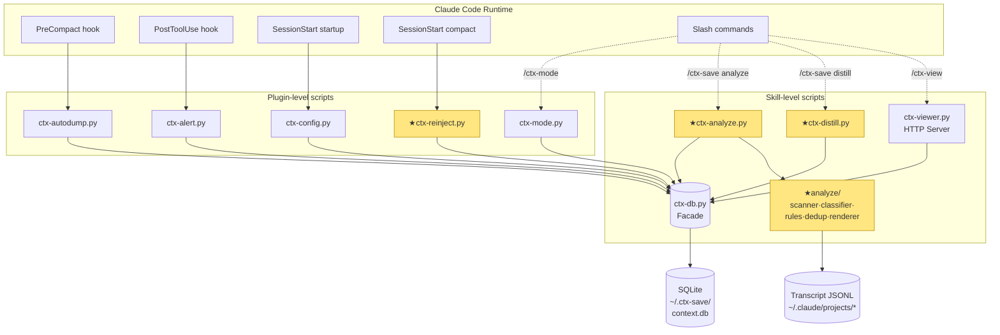
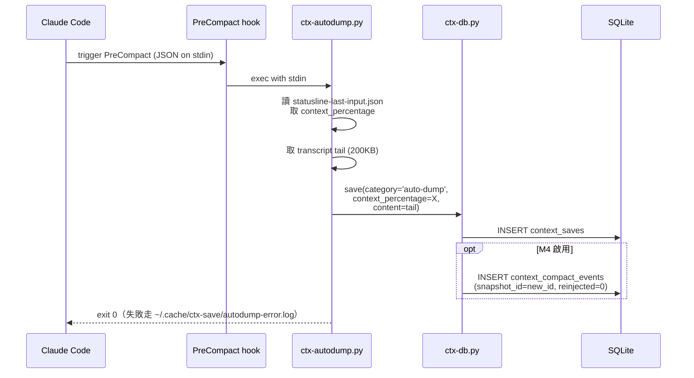
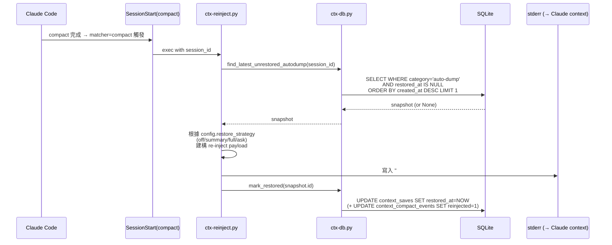
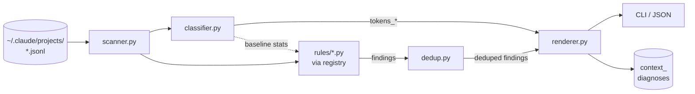
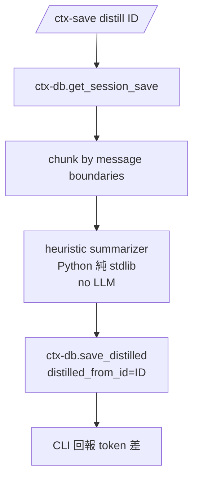

# ctx-save v3 架構設計

> **文件類型**：架構設計文件
> **技術棧**：Python 3 標準庫（零 pip 依賴） + 原生 HTML/CSS/JS
> **上游文件**：[spec.md](./spec.md) · [db.md](./db.md)
> **撰寫日期**：2026-04-21

---

## 1. 整體架構概觀

### 1.1 兩層分工（plugin-level vs skill-level）

ctx-save 沿用 Claude Code plugin 的**兩層腳本分工**：

```
plugins/ctx-save/
├── scripts/             ← Plugin-level：Hook 進入點（必須快、零拋錯）
│   ├── ctx-alert.py         (PostToolUse)
│   ├── ctx-autodump.py      (PreCompact)
│   ├── ctx-config.py        (SessionStart startup)
│   ├── ctx-mode.py          (slash command `/ctx-mode`)
│   └── ctx-reinject.py      ★v3 新  (SessionStart matcher=compact)
│
└── skills/
    ├── ctx-save/scripts/    ← Skill-level：重邏輯、CLI、HTTP server
    │   ├── ctx-db.py            (DB facade)
    │   ├── ctx-viewer.py        (Web Viewer)
    │   ├── ctx-analyze.py   ★v3 新  (診斷入口)
    │   ├── ctx-distill.py   ★v3 新  (瘦身入口)
    │   └── analyze/         ★v3 新  (診斷子模組)
    ├── ctx-view/            (啟動 Web Viewer)
    ├── ctx-view-stop/       (停止)
    └── ctx-mode/            (切換觸發模式)
```

**分工原則**：
| 層 | 允許的事 | 禁止的事 |
|----|---------|---------|
| plugin-level scripts | import stdlib、讀寫 DB、讀取 stdin JSON、寫 stderr、背景 exec | 長時間阻塞（> 2s）、拋 Exception 中斷 Claude Code、依賴 skill 層 import |
| skill-level scripts | 複雜計算、HTTP server、長連線、CLI 互動 | 不該被 hook 直接呼叫（透過 plugin-level 中介） |

### 1.2 整體架構圖



黃色節點為 v3 新增；其餘為 v2.3 既有。

---

## 2. 核心閉環資料流（v3 的關鍵）

v3 最重要的演進是 **PreCompact → SessionStart(matcher=compact)** 的兩階段資料流閉環。

### 2.1 Stage 1：PreCompact（既有 v2.3，補欄位）



### 2.2 Stage 2：SessionStart matcher=compact（★v3 新）



### 2.3 restore_strategy 策略模式

`ctx-reinject.py` 內部用策略模式決定還原格式：

```python
# analyze/restore_strategy.py（plugin 層直接用）
class RestoreStrategy(Protocol):
    def render(self, snapshot: dict) -> str: ...

class OffStrategy:         # 不注入
class SummaryStrategy:     # 注入 title + 摘要（前 N 字）
class FullStrategy:        # 注入完整 content
class AskStrategy:         # 注入 title + 請 Claude 問是否還原

STRATEGIES: dict[str, RestoreStrategy] = {
    'off': OffStrategy(), 'summary': SummaryStrategy(),
    'full': FullStrategy(), 'ask': AskStrategy(),
}
```

選擇理由：新增策略只要加一檔，無需改 `ctx-reinject.py` 主流程（OCP）。

### 2.4 錯誤處理契約

**Hook 必須永不中斷 Claude Code**：

| 失敗情境 | 處理 |
|---------|------|
| SQLite 鎖定 / DB 檔不存在 | 寫 `~/.cache/ctx-save/reinject-error.log` → `exit 0` |
| 沒找到 unrestored snapshot | silent exit 0（合理情境，非錯誤） |
| `restore_strategy='off'` | silent exit 0 |
| stderr 寫入失敗 | 嘗試寫 error log → `exit 0` |
| 任何 Exception | `try/except Exception: exit 0`（最外層兜底） |

所有 plugin-level script 必須遵守此契約。參考 `ctx-autodump.py::main()` 的既有範式。

---

## 3. ctx-analyze 模組分層

### 3.1 目錄 / 責任

```
skills/ctx-save/scripts/
├── ctx-analyze.py                  # 入口（CLI + Slash）
└── analyze/
    ├── __init__.py
    ├── scanner.py                  # 讀 JSONL → 原始事件流
    ├── classifier.py               # 五類 token 歸類
    ├── rules/
    │   ├── __init__.py
    │   ├── registry.py             # 規則註冊中心
    │   ├── duplicate_read.py       # 每檔一規則，≤ 60 行
    │   ├── autodump_cluster.py
    │   ├── unused_mcp_server.py
    │   ├── claudemd_bloat.py
    │   ├── short_turns_noise.py
    │   └── user_prompt_spike.py
    ├── dedup.py                    # Layer 3 根因去重
    └── renderer.py                 # Layer 4 預算 + CLI/JSON 格式化
```

### 3.2 資料流



### 3.3 每層介面

```python
# scanner.py — 將 JSONL 展開成結構化事件序列
@dataclass(frozen=True)
class Event:
    idx: int                    # 訊息序號
    ts: datetime
    role: str                   # user/assistant/system/tool
    kind: str                   # 'text'/'tool_use'/'tool_result'/'file_read'
    tokens_approx: int
    meta: dict                  # file_path / tool_name / mcp_server / ...

def scan(transcript_path: Path) -> list[Event]: ...


# classifier.py — 將 events 歸到五類 + 計算 session-level baseline
@dataclass(frozen=True)
class TokenBreakdown:
    conversation: int
    files: int
    tools_schema: int
    tools_runtime: int
    system: int

@dataclass(frozen=True)
class SessionBaseline:
    """Layer 2 自校基準：提供 rule 判斷『本 session 內算多嗎』"""
    files_avg_tokens: float
    files_p80_tokens: float
    total_tokens: int
    recent_turns_window: list[Event]    # 最近 20 輪供 short_turns_noise 用

def classify(events: list[Event]) -> tuple[TokenBreakdown, SessionBaseline]: ...


# rules/registry.py — 註冊中心與 Rule Protocol
@dataclass(frozen=True)
class Finding:
    type: str                    # e.g. 'duplicate_read'
    severity: str                # 'low'/'medium'/'high'
    root_cause_key: str          # Layer 3 去重依據
    summary: str                 # 一行人類可讀摘要
    detail: dict                 # rule-specific payload

class Rule(Protocol):
    name: str
    def apply(self, events: list[Event], tokens: TokenBreakdown,
              baseline: SessionBaseline) -> list[Finding]: ...

_RULES: list[Rule] = []

def register(rule: Rule) -> None: ...
def all_rules() -> list[Rule]: ...


# dedup.py — Layer 3 根因去重
def dedup(findings: list[Finding]) -> list[Finding]:
    """同 root_cause_key 取 severity 最高者；被壓的附註到勝者 detail['also_matched']"""


# renderer.py — Layer 4 預算 + 輸出
@dataclass
class Report:
    session_id: str
    ran_at: datetime
    score: int
    tokens: TokenBreakdown
    findings: list[Finding]
    suggest_focus: str | None

def render_cli(report: Report, show_all: bool = False) -> str: ...
def render_json(report: Report) -> dict: ...
def compute_score(findings: list[Finding]) -> int: ...
def compute_suggest_focus(findings: list[Finding]) -> str | None: ...
```

### 3.4 Rule 範例骨架

```python
# rules/duplicate_read.py
from ..rules.registry import Finding, Rule, register

class DuplicateRead:
    name = "duplicate_read"
    def apply(self, events, tokens, baseline):
        counts = Counter()
        costs  = defaultdict(int)
        for e in events:
            if e.kind == "file_read":
                f = e.meta["file_path"]
                counts[f] += 1
                costs[f]  += e.tokens_approx
        out: list[Finding] = []
        for f, c in counts.items():
            if c < 4: continue
            if costs[f] < 2000: continue
            if costs[f] / max(tokens.conversation, 1) < 0.05: continue
            out.append(Finding(
                type=self.name, severity="medium",
                root_cause_key=f"duplicate_read:{f}",
                summary=f"{f} read {c} times (~{costs[f]} tokens)",
                detail={"file": f, "count": c, "estimated_tokens": costs[f]},
            ))
        return out

register(DuplicateRead())
```

每 rule：pure function、≤ 60 行、無副作用（不寫 DB、不寫檔）。

### 3.5 設計模式對應

| 模式 | 應用 |
|------|------|
| **Registry** | `rules/registry.py` — 新增規則只要 `register(MyRule())`，無需改主流程 |
| **Pipeline** | scanner → classifier → rules → dedup → renderer，階段清楚、易測 |
| **Strategy** | `RestoreStrategy`（§2.3）、同樣可用在未來的 findings renderer 變體 |
| **Immutable DTO** | `Event`/`TokenBreakdown`/`Finding`/`Report` 全用 `@dataclass(frozen=True)` — 對應全域規範「Immutability」 |
| **Facade** | `ctx-db.py` 對外公開 `save / find_* / list_*`，其他模組不直接寫 SQL |

---

## 4. Web Viewer 四 Tab 架構

### 4.1 路由分層

v2.3 `ctx-viewer.py` 的 `RequestHandler` 已是單 class 統一處理路由。v3 擴充 API 但**不拆檔** — 對應低依賴原則。

```
RequestHandler (BaseHTTPRequestHandler)
├── do_GET(path)
│   ├── /                    → _render_shell_html()  ★v3 改：掛 tab router
│   ├── /api/ping            → _handle_ping()
│   ├── /api/projects        → _handle_projects()
│   ├── /api/sessions        → _handle_sessions()
│   ├── /api/saves/:id       → _handle_save_detail()
│   ├── /api/search          → _handle_search()
│   ├── /api/stats           → _handle_stats()
│   │   ── v3 新增 ──
│   ├── /api/diagnoses                → ★_handle_diagnoses_list()
│   ├── /api/diagnoses/:id            → ★_handle_diagnosis_detail()
│   ├── /api/persistent               → ★_handle_persistent_list()
│   ├── /api/compact-events           → ★_handle_compact_events()
│   └── /api/dashboard/health         → ★_handle_dashboard_health()
│
├── do_POST(path)
│   ├── /api/saves/batch-delete
│   ├── ★/api/diagnoses/run            — 觸發 ctx-analyze（背景 exec）
│   ├── ★/api/saves/:id/distill        — 觸發 ctx-distill
│   └── ★/api/saves/:id/pin            — 切 is_persistent
│
└── do_DELETE(path)
    ├── /api/saves/:id
    ├── /api/session/:id
    └── ★/api/diagnoses/:id
```

### 4.2 前端 Tab 架構（原生 JS）

```
index.html (shell)
├── <header>                ← sidebar: projects / sessions
└── <main>                  ← tab container
    ├── #tab-timeline       ★v3 新  (compact events, N6+N8 SVG)
    ├── #tab-dashboard      ★v3 新  (五類 token 圓餅 + 最新 score + findings)
    ├── #tab-diagnostics    ★v3 新  (findings 列表，可展開 detail)
    ├── #tab-persistent     ★v3 新  (is_persistent=1 筆記)
    └── #tab-saves          (現有列表，保留為「全部快照」)
```

Router：`window.location.hash` 驅動（`#/dashboard`、`#/timeline/:sessionId`）。純 vanilla JS，無框架。

### 4.3 Tab 資料來源對照

| Tab | API | DB Table |
|-----|-----|----------|
| Timeline | `/api/compact-events` | `context_compact_events`（或 fallback 查 `context_saves WHERE category='auto-dump'`） |
| Dashboard | `/api/dashboard/health` | `context_diagnoses`（最新一筆）+ `context_saves` 統計 |
| Diagnostics | `/api/diagnoses`, `/api/diagnoses/:id` | `context_diagnoses` |
| Persistent | `/api/persistent` | `context_saves WHERE is_persistent=1` |
| Saves (現有) | `/api/sessions`, `/api/saves/:id` | `context_saves` |

---

## 5. ctx-db Facade 擴充

### 5.1 現有介面（v2.3）

```python
# 既有
def save(db_path, records)
def list_sessions(db_path, ...)
def get_session(db_path, session_id)
def search(db_path, ...)
def clean(db_path, days)
def list_projects(db_path)
def stats(db_path)
def init_db(db_path)
```

### 5.2 v3 新增介面

```python
# --- Reinject 閉環 ---
def find_latest_unrestored_autodump(db_path, session_id) -> Optional[dict]
def mark_restored(db_path, save_id: int) -> None
def mark_compact_event_reinjected(db_path, event_id: int) -> None

# --- Persistent notes ---
def pin_save(db_path, save_id: int, pinned: bool = True) -> None
def list_persistent(db_path, project_path: Optional[str] = None) -> list[dict]

# --- Distill ---
def save_distilled(db_path, source_id: int, title: str, content: str) -> int
def list_distilled_from(db_path, source_id: int) -> list[dict]

# --- Diagnoses ---
def save_diagnosis(db_path, diagnosis: dict) -> int
def list_diagnoses(db_path, session_id: Optional[str] = None,
                   project_path: Optional[str] = None, limit: int = 50) -> list[dict]
def get_diagnosis(db_path, diag_id: int) -> Optional[dict]
def delete_diagnosis(db_path, diag_id: int) -> None

# --- Compact events (M4) ---
def record_compact_event(db_path, session_id: str, project_path: str,
                          happened_at: datetime, trigger: str,
                          context_pct: float, snapshot_id: int) -> int
def list_compact_events(db_path, session_id: Optional[str] = None,
                         days: int = 30) -> list[dict]

# --- Migration（v3 新增，沿用 _run_all_migrations 架構）---
def migrate_add_persistent(conn) -> bool
def migrate_add_restored_at(conn) -> bool
def migrate_add_distilled_from(conn) -> bool
def migrate_create_diagnoses_table(conn) -> bool
def migrate_create_compact_events_table(conn) -> bool
```

### 5.3 Facade 的價值

- 所有 SQL 集中 `ctx-db.py`，其他模組不直接寫 SQL
- Hook script（plugin-level）透過 `importlib.util.spec_from_file_location` 載入 skill 層的 `ctx-db`，維持單一 source-of-truth
- 對應 `.claude/rules/design-patterns.md` 的 Repository Pattern

---

## 6. Hook 註冊變更

### 6.1 v2.3 `hooks.json`（既有）

```json
{
  "hooks": {
    "PostToolUse": [{"matcher": "*", "hooks": [{"type": "command", "command": "${CLAUDE_PLUGIN_ROOT}/scripts/ctx-alert.py"}]}],
    "PreCompact":  [{"matcher": "*", "hooks": [{"type": "command", "command": "${CLAUDE_PLUGIN_ROOT}/scripts/ctx-autodump.py"}]}],
    "SessionStart":[{"matcher": "*", "hooks": [{"type": "command", "command": "${CLAUDE_PLUGIN_ROOT}/scripts/ctx-config.py init"}]}]
  }
}
```

### 6.2 v3 `hooks.json`（變更）

```json
{
  "hooks": {
    "PostToolUse": [
      {"matcher": "*", "hooks": [{"type": "command", "command": "${CLAUDE_PLUGIN_ROOT}/scripts/ctx-alert.py"}]}
    ],
    "PreCompact": [
      {"matcher": "*", "hooks": [{"type": "command", "command": "${CLAUDE_PLUGIN_ROOT}/scripts/ctx-autodump.py"}]}
    ],
    "SessionStart": [
      {"matcher": "startup", "hooks": [{"type": "command", "command": "${CLAUDE_PLUGIN_ROOT}/scripts/ctx-config.py init"}]},
      {"matcher": "resume",  "hooks": [{"type": "command", "command": "${CLAUDE_PLUGIN_ROOT}/scripts/ctx-config.py init"}]},
      {"matcher": "compact", "hooks": [{"type": "command", "command": "${CLAUDE_PLUGIN_ROOT}/scripts/ctx-reinject.py"}]}
    ]
  }
}
```

**變更重點**：
1. `SessionStart` 由單一 `matcher: *` 拆成 3 個 matcher（`startup` / `resume` / `compact`）
2. `compact` matcher 綁 `ctx-reinject.py`（v3 閉環關鍵）
3. `startup`/`resume` 仍跑 config init 與 legacy migration（沿用 v2.3 行為）

---

## 7. ctx-distill 架構（M4）



### 7.1 Heuristic summarizer 策略

因**零 API 呼叫**，distill 不能呼叫 LLM，採規則式壓縮：

1. 移除重複出現的 tool_result（保留第一次與最後一次）
2. 移除短於 20 tokens 的 user/assistant exchange
3. 保留 tool_use 的 input summary（刪 result body，留最前 200 bytes）
4. 保留所有含 `error`/`fail`/`exception` 關鍵字的訊息
5. 訊息間插入 `[N messages elided]` 佔位

預期壓縮比：60-80%（不追求極致，保留可讀性）。

### 7.2 為什麼不做 embedding-based summary

- 需要 numpy/torch，違反零 pip 依賴
- 本地 LLM 呼叫又超出「零外部服務」
- 規則式即便粗糙，已能讓使用者快速挑掉大量 token

---

## 8. 設計模式總表

| 模式 | 使用處 | 動機 |
|------|-------|------|
| **Facade** | `ctx-db.py` | 集中 SQL，其他模組依賴穩定 API |
| **Strategy** | `RestoreStrategy`（off/summary/full/ask） | restore 行為可替換，新增策略不動 reinject 主流程 |
| **Registry** | `analyze/rules/registry.py` | 加 rule 只要新檔 + register，不改呼叫端 |
| **Pipeline** | analyze 五階段 | 階段隔離，每段單測 |
| **Template Method** | `_run_all_migrations()` | 固定骨架，每個 migration 實作相同 `(conn) -> bool` 介面 |
| **Observer** | Hook 機制本身 | Claude Code 發事件，plugin 監聽（Claude Code 框架層已提供） |
| **Immutable DTO** | `Event`/`Finding`/`Report`/`TokenBreakdown`/`SessionBaseline` | 對應全域 coding-style.md 不可變原則 |
| **Repository** | ctx-db 的 `find_*` / `save_*` | 隔離儲存細節 |

---

## 9. 類別 / 模組總覽（v3 新增）

| 層 | 檔案 | 類別/模組 | 職責 |
|----|------|----------|------|
| plugin | `scripts/ctx-reinject.py` | `main()`, `ReinjectConfig` | SessionStart(compact) 讀 config、找 snapshot、渲染 stderr |
| plugin | `scripts/ctx-reinject.py` | `RestoreStrategy` Protocol + 4 實作 | off/summary/full/ask |
| skill | `scripts/ctx-analyze.py` | `main()` CLI | 參數解析、打 pipeline、落 DB |
| skill | `analyze/scanner.py` | `scan(path) -> list[Event]` | JSONL 解析 |
| skill | `analyze/scanner.py` | `Event` dataclass | 結構化訊息事件 |
| skill | `analyze/classifier.py` | `classify(events) -> (TokenBreakdown, SessionBaseline)` | 五類歸類 + baseline |
| skill | `analyze/rules/registry.py` | `Finding`, `Rule` Protocol, `register`, `all_rules` | 規則註冊中心 |
| skill | `analyze/rules/*.py` × 6 | `DuplicateRead` / `AutodumpCluster` / `UnusedMcpServer` / `ClaudemdBloat` / `ShortTurnsNoise` / `UserPromptSpike` | 六條規則（§6.4） |
| skill | `analyze/dedup.py` | `dedup(findings) -> list[Finding]` | Layer 3 根因去重 |
| skill | `analyze/renderer.py` | `Report` dataclass | 診斷結果值物件 |
| skill | `analyze/renderer.py` | `render_cli`, `render_json`, `compute_score`, `compute_suggest_focus` | Layer 4 預算 + 輸出 |
| skill | `scripts/ctx-distill.py` | `main()` CLI, `distill(content) -> str` | 規則式壓縮入口 |
| skill | `scripts/ctx-viewer.py` | `RequestHandler._handle_diagnoses_*` 等 | Web API v3 端點 |
| skill | `scripts/ctx-db.py` | 新增 §5.2 介面 | Facade 擴充 |

---

## 10. 測試策略分層

| 層級 | 目標 | 工具 |
|------|------|------|
| **Unit**（analyze/ 各模組） | 每個 rule pure function，給假 events 列表驗預期 findings | `unittest`（stdlib），fixture 為 `.jsonl` 小樣本 |
| **Migration idempotency** | 跑兩次 `_run_all_migrations()` 第二次全回 False | 用 `:memory:` SQLite |
| **Hook 契約** | ctx-reinject 在 DB 不存在 / SQLite lock / None snapshot 三情境全部 `exit 0` | subprocess + `CTX_SAVE_DB` 指向暫存檔 |
| **Pipeline integration** | 給一個 real Claude Code JSONL（redacted）跑完全程，驗 findings 不超過 budget 上限 | 3 個 golden session fixture |
| **Web API** | 對每個新 endpoint 下手動 curl，驗 JSON shape | shell script |

零 pip 依賴的對應：**全用 stdlib `unittest`**，不引入 pytest。

---

## 11. 相容性邊界

| 邊界 | 處理 |
|------|------|
| v2.3 既有 DB 升級到 v3 | migration flag `.migration-v3-done` 首次啟動觸發，冪等 |
| v3 安裝後 downgrade 回 v2.3 plugin | v2.3 ctx-db 讀不到新欄位但不會拋錯；新表被閒置 |
| 使用者手動刪 `.migration-v3-done` | 下次啟動重跑 migration；因每個 migrate_* 冪等，無副作用 |
| Claude Code 版本不支援 `matcher: compact` | `ctx-reinject.py` 不會被觸發 → v3 退化為「v2.3 + analyze/distill/Web 升級」，仍可用 |

---

## 12. 風險與緩解

| 風險 | 嚴重度 | 緩解 |
|------|-------|------|
| Reinject 注入過量 stderr 反而更快吃 context | 高 | `restore_strategy=summary` 預設 + `max_reinject_bytes` config 上限（預設 4KB） |
| PreCompact 寫入慢拖到主對話 | 中 | 沿用 v2.3 的 fire-and-forget；exception 靜音到 error log |
| analyze 讀大 JSONL 慢 | 中 | scanner 用 line-by-line streaming，不整檔載入；fallback `sys.argv --limit` 截最近 N 訊息 |
| Rule false positive 太多 | 中 | §6.4 四層防噪架構已吸收；Budget 預設 5 條 |
| 新 migration 在舊 SQLite 3.30 下語法錯 | 低 | 所有 migration 只用 `ALTER TABLE ADD COLUMN` + `CREATE TABLE/INDEX IF NOT EXISTS`，3.30 全支援 |

---

## 13. 與上游文件對應

| arch 章節 | spec.md | db.md |
|----------|---------|-------|
| §1 目錄結構 | §附錄 B | — |
| §2 閉環資料流 | §7 | §6.4 寫入時機 |
| §3 analyze 模組 | §6 | §5 |
| §4 Web Viewer | §5 | §5（表視圖） |
| §5 Facade 擴充 | §8 hook | §4-§6 所有表 |
| §6 Hook 註冊 | §8 | — |
| §7 ctx-distill | §3.2 N3 | §4.1 distilled_from_id |
| §11 相容性 | §9 | §7 Migration 策略 |

---

**文件終**
