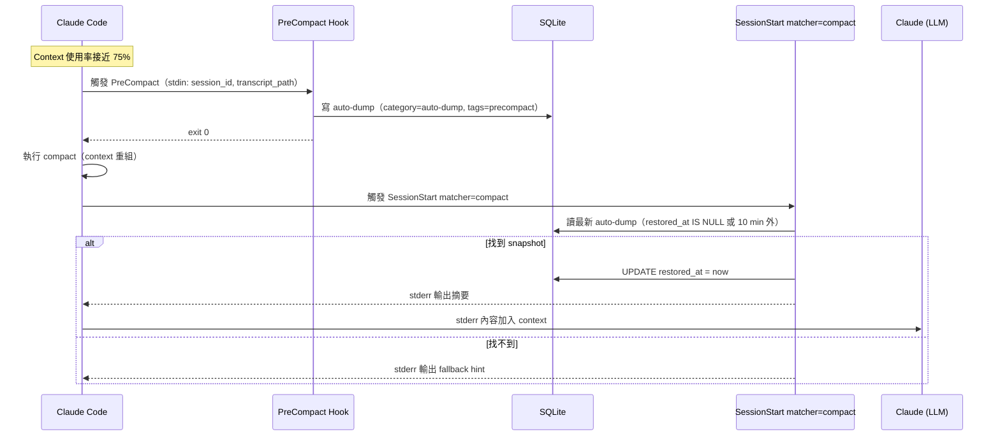

# ctx-save v3 功能規格

> **文件類型**：大版本規格書
> **對應版本**：ctx-save 3.0.0（由 v2.3.1 演進）
> **撰寫日期**：2026-04-21
> **狀態**：草案（尚未實作）
> **技術棧限制**：Python 3 標準庫（零 pip 依賴，零外部服務）

---

## 1. 版本目標

v3 要解決一個 v2.3 遺留的核心缺口：**Restore 仍然需要使用者主動操作，compact 後沒有「自動把重點注回對話」的閉環**。PreCompact hook 已經在 SQLite 存 raw transcript tail，但 compact 結束後 Claude 看不到剛存了什麼，使用者還是得手動 `/ctx-save restore` 再挑一筆貼回去。

v3 的三條主軸：

1. **閉環**：SessionStart `matcher="compact"` 自動把最新 snapshot 摘要注回 stderr，讓 Claude 無縫接續。
2. **診斷**：新增 `/ctx-save analyze` — 讀 transcript JSONL 做 token 分類、浪費偵測、產生可貼修正指令，對標 claude-crusts 但嚴守 Python 標準庫。
3. **管理 UI**：Web Viewer 從「歷史瀏覽器」升級成「對話健康儀表板」，加 timeline、token budget、compact 事件軸、重複快照清理。

明確不做的事：不做 Obsidian/Graphify 整合、不接任何外部服務、不改「一鍵安裝馬上能用」的體驗、不加任何 pip 依賴。

---

## 2. 從四個參考 repo 借鑑什麼

每個 repo 都有值得學的地方，但也有與 ctx-save 定位不符的部分。逐一區分。

### 2.1 claude-crusts — 診斷角度

| 項目 | 借 / 不借 | 理由 |
|------|----------|------|
| 六類 token 分類（C/R/U/S/T/S） | **借**（重組成五類：對話 / 檔案讀取 / 工具 schema / 工具 runtime / 系統提示） | ctx-save 本來就在讀 `statusline-last-input.json` 拿使用率，但沒做拆解。加拆解能解釋「為什麼這麼滿」。**五類而非六類**的理由見 §6.3：每類必須對應到具體修復路徑，claude-crusts 的 U/State 在 ctx-save 場景無修復動作；Tool 拆 schema vs runtime 反而讓修復路徑更清楚 |
| 讀 `~/.claude/projects/*.jsonl` 做分析 | **借** | Claude Code 原生儲存點，零 API 呼叫，符合「不接外部服務」原則 |
| 重複檔案讀取偵測 | **借** | 和 ctx-save 的 category=change/finding 天然互補，能自動標出「這幾筆存得太密」 |
| 未使用工具 schema 偵測 | **借**（簡化版：只做警示，不做修復） | 對使用者決策有幫助，但 ctx-save 不負責改 MCP 配置 |
| `fix` 指令產三段可貼 prompt | **借**（只保留「/compact focus on...」那一段） | ctx-save 的場景就是 compact 前，這正是最有用的那一段。其他兩段（session prompt / CLAUDE.md 片段）偏離 ctx-save 定位 |
| TUI REPL | **不借** | ctx-save 已有 Web Viewer 與 slash command，再做 TUI 是重工 |
| 跨 session 趨勢分析 | **借**（簡化版） | 已有 SQLite，加個「每日 compact 次數」統計幾乎零成本 |
| `watch` 即時 dashboard | **不借** | Web Viewer 加輪詢即可，不需要獨立子指令 |
| 執行環境（TypeScript/Bun） | **不借** | 必須維持 Python 標準庫。重新實作分類邏輯（演算法很直觀，幾百行） |
| `calibrate` 對齊 `/context` 輸出 | **不借** | ctx-save 直接用 statusline 的 `used_percentage`，已是 Claude Code 官方值，不需要再校準 |

**為什麼適合 ctx-save**：ctx-save 原本是「後知後覺」工具——使用者發現 context 快滿才存。加上診斷後變成「先知先覺」——開著 Web Viewer 就能看出「10 分鐘前那輪 Agent 讀了 9 次同一個檔」，手動觸發 compact focus hint。

### 2.2 lucasrosati/claude-code-memory-setup — 減量角度

| 項目 | 借 / 不借 | 理由 |
|------|----------|------|
| Obsidian vault 作為持久記憶 | **不借** | 破壞「一鍵安裝」。使用者裝 ctx-save 不應該被迫裝 Obsidian |
| Graphify AST 程式碼知識圖譜 | **不借** | 需要 `pip install graphifyy`，違反零 pip 依賴 |
| 三層 query rule（graph → vault → raw） | **不借** | 這是 Obsidian 生態特有流程，ctx-save 不組 RAG |
| Chat import pipeline（cron 每晚匯入） | **部分借** | 概念好：把 compact 前 snapshot 視為可累積資產。落地方式不同：不用 cron，而用 PreCompact hook（已有） |
| `/resume` 指令（讀最近 N 筆日誌） | **借** | 這是 ctx-save 閉環缺的那一塊。改名為 `/ctx-save resume`（可選）或直接由 SessionStart 自動做（預設） |
| `/save` 產出 session log + 自動 commit | **借 save 概念、不借 commit** | ctx-save 已有 `/ctx-save`。commit 會污染使用者的 git 歷史，不加 |
| Zettelkasten atomic notes + wikilinks | **不借** | ctx-save 不做 PKM，保持輕量 |
| 71.5× 減量宣稱 | **借方向但不借數字** | v3 不打「減 token」大旗。定位是「compact 後無縫接續」，不是「永不 compact」 |
| 持久記憶（不隨 clean 刪除） | **借** | 新增 `persistent` 旗標欄位。清理 N 天前記錄時跳過這批（見 §4） |

**為什麼適合 ctx-save**：memory-setup 整套太重，但「讓某些 snapshot 變長效」是有用的概念。使用者累積的「關鍵架構決策」「重要 bug 根因」不該因為 `clean 30` 被刪。

### 2.3 mcpware/claude-code-organizer — 管理 UI 角度

| 項目 | 借 / 不借 | 理由 |
|------|----------|------|
| Web dashboard 單一介面統管多類項目 | **借** | ctx-view 已有 Web UI，擴充方向清楚 |
| Token budget tracker（pre-loaded vs deferred 拆解） | **借** | 接 `/ctx-save analyze` 的分類結果，自然呈現為 Web 視圖 |
| Tool poisoning scanner（MCP 安全掃描） | **不借** | 偏離 ctx-save 定位。使用者需要掃 MCP 去用 organizer |
| Duplicate cleanup + shadow/conflict badges | **借**（簡化） | ctx-save 場景的「重複」不是 scope 衝突，而是同一 session 多次 auto-dump。視圖顯示「這 3 筆 auto-dump 差不到 5 分鐘」並提供一鍵合併 |
| Scope management（global / project / ancestor） | **不借** | ctx-save 用中央 DB + project_path 欄位，已經有 project 隔離，不需要再疊一層 scope |
| Session distill（strip tool results） | **借** | 和 ctx-save 的 auto-dump 互補：auto-dump 存 raw tail 200KB，distill 可把它瘦身到 50KB 存成新筆。這對「保留但省空間」有幫助 |
| Undo everything | **借** | Web Viewer 刪除已有 soft delete（`deleted_at`），UI 補上「Undo 最近一次刪除」按鈕 |
| `/cco` skill auto-install | **借思路** | 其實 ctx-save 已經是 plugin，hook 自動註冊，邏輯相似 |
| 零 production dependency | **借** | 正好對齊我們的限制 |
| Node.js 實作 | **不借** | 維持 Python 標準庫 |

**為什麼適合 ctx-save**：organizer 的「scan→find→fix 一個迴路」介面哲學值得學。ctx-view 目前是被動瀏覽，加診斷視圖後就能「看到問題 → 直接修」。

### 2.4 VoxCore84/claude-code-compaction-keeper — 自動還原閉環角度

| 項目 | 借 / 不借 | 理由 |
|------|----------|------|
| Two-stage 模型（PreCompact 存 → SessionStart 還原） | **借** | 這是 ctx-save v3 的**核心缺口**。現況 Stage 1 已有（`ctx-autodump.py`），Stage 2 缺席（只做 config init） |
| `SessionStart matcher="compact"` 只在 compact 後觸發 | **借** | 和 `matcher="startup"` / `matcher="resume"` 區隔，避免每次開 session 都倒資料 |
| 輸出到 stderr 讓 Claude 讀到 | **借** | 這是 Claude Code hook 注入 context 的標準手法 |
| 只存 tool-level signals（檔案、工具、頻率） | **不借** | ctx-save 已經存 raw transcript tail，素材比 tool signals 豐富。v3 沿用 raw tail + 附加語意摘要 |
| 2 小時 lookback window | **不借** | ctx-save 用 transcript_tail_kb 控制範圍，更直接 |
| 無失敗 fallback | **不借其無 fallback** | ctx-save 要加三層 fallback（見 §7.3） |
| `session-stats.jsonl` 獨立工具計量 | **不借** | 直接讀 Claude Code 原生 `~/.claude/projects/*.jsonl`（和 claude-crusts 同路線），不再起一個側錄檔 |
| Python 3.10+ 標準庫 | **借** | 完全對齊 |

**為什麼適合 ctx-save**：compaction-keeper 是 ctx-save v3 最該借鑑的 repo。兩段式流程正是 v2.3 欠缺的閉環，而且它的技術選型（Python stdlib、讀 hook stdin、寫 stderr）和 ctx-save 完全相容。

---

## 3. 功能清單

分成「擴充既有功能」與「全新功能」。每項採同一結構：**名稱 / 使用者痛點 / 指令或介面 / 實作摘要 / 風險 / 如果不做的理由**。

### 3.1 擴充既有功能

#### F1. `/ctx-save` 擴充：新增 `--persistent` 旗標

- **痛點**：使用者存了一筆「架構決策」，想永久保留，但 `clean 30` 把它刪了。
- **指令**：`/ctx-save --persistent` 或在選項步驟勾選「標為長效」。
- **實作**：schema 加 `is_persistent INTEGER DEFAULT 0`（見 §4.1）。`ctx-db.py clean` 改成 `WHERE created_at < ? AND is_persistent = 0`。Web Viewer 列表顯示 🔒 圖示。
- **風險**：使用者不知道可用旗標；預設 0 = 可刪，語意保留舊行為。
- **不做的理由**：若使用者手動維護 markdown 副本，可自行 cp 到另一個資料夾。但這違反「一鍵就好」原則，還是做。

#### F2. `/ctx-save restore` 擴充：支援 `--latest-compact`

- **痛點**：想一鍵貼回最近一次 compact 前存的東西，不用挑編號。
- **指令**：`/ctx-save restore --latest-compact`。
- **實作**：`ctx-db.py` 新增 `latest` 子指令，`WHERE category='auto-dump' AND tags LIKE '%precompact%' ORDER BY created_at DESC LIMIT 1`。
- **風險**：若 auto-dump 被 distill 處理過，要小心 distill 後筆記也要算進「最近一次」。
- **不做的理由**：手動 `/ctx-save list` + `get <id>` 能做，但不做會讓 §7 自動還原難設計（共用程式碼路徑）。

#### F3. `/ctx-view` 擴充：診斷分頁 + Timeline

- **痛點**：Web Viewer 現在只能看歷史，看不出「現在在哪個健康狀態」。
- **介面**：頂部 tab 新增「Dashboard」「Timeline」「Diagnostics」「Persistent」。
- **實作**：新增三個 HTTP 路由 `/api/dashboard`, `/api/timeline`, `/api/diagnostics`；前端用原生 JS + `<canvas>` 畫 sparkline（已有純 JS 慣例）。
- **風險**：Web Viewer 程式碼長度變大，要考慮 split 成多個檔（但仍在 skills/ctx-save/scripts/ 下）。
- **不做的理由**：只靠 CLI 也行，但 Web Viewer 是 v2 賣點，不擴充就浪費。

#### F4. `/ctx-mode` 擴充：`restore` 子指令

- **痛點**：想把「自動還原閉環」關掉（例如在某個 session 裡想要乾淨 compact）。
- **指令**：`/ctx-mode restore on` / `off` / `summary` / `full` / `ask`。
- **實作**：config.json 加 `restore_strategy` 欄位，值為 `off / summary / full / ask`。`ctx-config.py` 的 `coerce()` 擴充一個新 case。
- **風險**：config 欄位越加越多，需要版本化 config schema。
- **不做的理由**：硬編碼成「summary」也行，但失去使用者調控空間。強制 auto-restore 對某些「清洗式 compact」使用者體感差。

#### F5. Hook 行為微調：auto-dump 加 context_percentage

- **痛點**：PreCompact auto-dump 目前把 `context_percentage` 寫死成 0，Web Viewer 看不出「當時多滿」。
- **實作**：`ctx-autodump.py` 讀 `/tmp/claude/statusline-last-input.json`，把 `used_percentage` 補上。
- **風險**：statusline 檔案在 PreCompact 瞬間可能已過期（Claude Code 先做計算再觸發 hook）。接受誤差。
- **不做的理由**：資訊量小但 Web Viewer 顯示改善很大，做。

### 3.2 全新功能

#### N1. 自動還原閉環（SessionStart matcher="compact"）

- **痛點**：compact 結束後 Claude 不記得剛才在做什麼，使用者還要手動 /ctx-save restore。
- **介面**：無使用者面向指令，全自動 hook。
- **實作**：新檔 `scripts/ctx-reinject.py`，註冊為 `SessionStart` hook with `matcher="compact"`。讀最新 `auto-dump` 記錄，依 `restore_strategy` 策略輸出到 stderr。詳見 §7。
- **風險**：stderr 輸出太長會再次撐爆 context。必須 summary 化。
- **不做的理由**：這是 v3 的靈魂，不做 v3 就沒意義。

#### N2. `/ctx-save analyze` — 對話健康診斷

- **痛點**：使用者感覺 context 變重但不知原因。
- **指令**：`/ctx-save analyze` 或 `/ctx-save analyze <session_id>`。
- **實作**：新檔 `scripts/ctx-analyze.py`，讀 `~/.claude/projects/<encoded>/<session>.jsonl`，做四類 token 分類（對話 / 檔案讀取 / 工具 schema / 系統提示），偵測「重複讀取同檔」「auto-dump 叢集」「過多短回合」。輸出診斷報告 + 「建議在下一個 /compact 加 focus hint: ...」。詳見 §6。
- **風險**：JSONL 格式改版會壞。加 schema_version 檢查與 graceful degrade。
- **不做的理由**：可以叫使用者裝 claude-crusts。但 ctx-save 想自成閉環，借其概念自實作。

#### N3. Session Distill — 歷史 auto-dump 瘦身

- **痛點**：auto-dump 每次存 200KB transcript tail，幾個月累積幾百 MB。
- **指令**：`/ctx-save distill [session_id | --older-than 7d]`。
- **實作**：新增 `scripts/ctx-distill.py`。對 auto-dump 筆記：保留 user messages 全文、tool call 保留 path/args 摘要、tool results 只留頭 5 行 + 尾 5 行。寫回同一筆（修改 `content`，附加 `tags += ',distilled'`）或新建「distilled」子記錄。預設後者（保留原檔備份）。
- **風險**：distill 演算法出 bug 可能刪資料。務必保留 `deleted_at` soft delete 回路。
- **不做的理由**：可以叫使用者手動 `clean`。但 clean 會刪整筆，distill 是精煉。

#### N4. Persistent Notes — 長效知識槽

- **痛點**：有些知識（API 邏輯、架構約定）應該跨 session 永久保留，但 v2.3 的 `context_saves` 表所有記錄都會被 `clean` 刪。
- **指令**：`/ctx-save pin <id>` 把某筆標成 persistent；`/ctx-save unpin <id>` 反向。
- **實作**：見 F1（`is_persistent` 欄位）+ Web Viewer 獨立 tab「🔒 Persistent」。
- **風險**：persistent 筆記過多會在每次 restore 時被拉進 context（若策略含 persistent）。需節流。
- **不做的理由**：跟 memory-setup 的 vault 重疊。但 ctx-save 的 persistent 只是「不刪」不是「主動檢索」，輕量得多。

#### N5. `/ctx-save compact` — 帶 focus hint 的封裝指令

- **痛點**：使用者知道要 `/compact focus on X.java`，但不確定 X 該填什麼。
- **指令**：`/ctx-save compact` → 先跑 analyze → 產出建議 focus hint → 讓使用者修改或直接送出。
- **實作**：把 `/ctx-save analyze` 的結果接到 AskUserQuestion：「建議 /compact focus on: 『xxx』，採用 Y/修改/取消」。採用則直接把指令輸出給使用者貼上（或如果 Claude Code 允許程式化送指令則送）。
- **風險**：Claude Code 目前沒有開放「程式送 slash 指令」API。接受輸出為「可貼字串」即可。
- **不做的理由**：可直接 `/ctx-save analyze` + 自己貼 `/compact`。但此指令是兩步合一，價值在於降低「做正確決策」門檻。

#### N6. Compact 事件時間軸（Web Viewer SVG）

- **痛點**：使用者想回答「這個月我被 compact 幾次？每次在做什麼？reinject 有沒有每次都成功？」
- **介面**：Timeline tab 的主視覺：一條水平時間軸，每個 compact 事件是一個點，hover 顯示 trigger (`auto`/`manual`)、context_percentage、snapshot 摘要、reinject 狀態。
- **實作**：後端查詢直接**沿用 N8 的 SQL 層**（避免重複邏輯）；`/api/timeline` 只是把 N8 的 JSON 結構餵給前端。前端畫 SVG + hover tooltip。
- **風險**：事件多時要分頁；降採樣規則需在查詢層統一（N8/N6 同步）。
- **不做的理由**：M1 已有 N8 CLI，視覺版可晚期做。但 Web Viewer 已是 v2 賣點，Timeline tab 不加會明顯缺一角。

#### N7. Diagnosis 結果結構化儲存

- **痛點**：`/ctx-save analyze` 每次重跑耗時，結果應該可回顧。
- **介面**：執行 analyze 後自動把結果存入 `context_diagnoses` 表（見 §4.2）。
- **實作**：新表記錄 `session_id, ran_at, score, findings_json`。
- **風險**：結果過期但還在 DB。加 `ran_at` 欄位讓使用者判斷。
- **不做的理由**：每次重跑也行，但失去 trend 能力（claude-crusts 借鑑點）。

#### N8. `/ctx-save events` — Compact 事件 CLI 視圖（M1 驗證工具）

- **痛點**：M1 閉環上線後，使用者（與開發者自己 dogfood）需要快速回答「上次 compact 有沒有被 reinject？何時？差了幾分鐘？」。Web Timeline（N6）在 M3 才做，M1 期間要有純文字替代品。
- **指令**：
  - `/ctx-save events` — 列最近 10 筆 compact 事件
  - `/ctx-save events --recent N` — 調整筆數（最多 200）
  - `/ctx-save events --session <id>` — 單一 session 的事件鏈
  - `/ctx-save events --html` — 輸出 self-contained HTML 到 stdout（單檔，inline CSS/JS；使用者可自行 `> file.html && open`）
- **實作**：新增 `ctx-db.py events <...>` 子指令，查詢：
  ```sql
  SELECT id, session_id, created_at, context_percentage,
         tags, title, restored_at
  FROM context_saves
  WHERE category = 'auto-dump'
  ORDER BY created_at DESC
  LIMIT ?;
  ```
  純文字渲染時計算 `restored_at - created_at` 顯示「差幾分鐘」，未 reinject 顯示 `✗`。HTML 模式用同一份資料，套一個 inline `<table>` + 簡單 CSS（不做 SVG）。
- **與 N6 的關係**：共用同一個 SQL 查詢層。N6 到 M3 做 Web Viewer 時只是換渲染器（SVG/互動），查詢邏輯不重寫。
- **風險**：CLI 輸出若欄位寬度不固定會跑版。固定 column width + truncate 長字串（如 session_id 只顯示前 8 碼）。
- **不做的理由**：M1 只用 `sqlite3 context.db '...'` 手打 SQL 也能驗證，但 dogfood 期間使用者無法這樣做；且 M3 Web Timeline 才看得到，等兩週太久。

### 3.3 功能依賴關係

```
          ┌─────────────────────────────────────────┐
          │ 閉環主線（M1 必做）                          │
          │   N1 auto-reinject ──┬── F4 restore_strategy │
          │                      └── F2 --latest-compact  │
          │   F5 context_pct 補值                      │
          │   N8 /ctx-save events（CLI 驗證工具）        │◄── 新增
          └─────────────────────────────────────────┘

          ┌─────────────────────────────────────────┐
          │ 診斷主線（M2 完成）                          │
          │   N2 analyze ──┬── N5 compact-with-focus │
          │                └── N7 diagnoses 表        │
          │                         │                  │
          │                         └── F3 Web Dashboard│
          └─────────────────────────────────────────┘

          ┌─────────────────────────────────────────┐
          │ 管理主線（M3/M4 交付）                       │
          │   N3 distill ─── N4 persistent (F1 pin)   │
          │   N6 compact timeline (SVG, 基於 N8 查詢)  │
          └─────────────────────────────────────────┘
```

---

## 4. 資料模型變更

目前 schema（v2.3）只有一張 `context_saves` 表。v3 需要：

1. `context_saves` 擴充三個欄位：`is_persistent`、`restored_at`、`distilled_from_id`
2. 新增 `context_diagnoses` 表（analyze 結果）
3. 新增 `context_compact_events` 表（精簡的 compact 時間軸，選做）

### 4.1 context_saves 欄位擴充

```sql
-- v3 新增欄位（冪等 migration）
ALTER TABLE context_saves ADD COLUMN is_persistent INTEGER NOT NULL DEFAULT 0;
ALTER TABLE context_saves ADD COLUMN restored_at DATETIME;
ALTER TABLE context_saves ADD COLUMN distilled_from_id INTEGER;

CREATE INDEX IF NOT EXISTS idx_saves_persistent ON context_saves(is_persistent);
CREATE INDEX IF NOT EXISTS idx_saves_restored ON context_saves(restored_at);
```

| 欄位 | 型別 | 用途 | 為什麼加 |
|------|------|------|---------|
| `is_persistent` | INTEGER 0/1 | 標記長效筆記 | N4 Persistent Notes 需要。`clean` 時 `WHERE is_persistent=0` |
| `restored_at` | DATETIME | 最近一次被 auto-reinject 的時間 | §7 自動還原後回寫，避免同一筆反覆重注（冷卻） |
| `distilled_from_id` | INTEGER | 若此筆由 distill 產生，指向原始 id | N3 distill 需要，讓 Web Viewer 顯示「這是 5 月 3 日某筆的瘦身版」|

`clean` 語法同步改成：

```sql
DELETE FROM context_saves
WHERE created_at < ?
  AND deleted_at IS NULL
  AND is_persistent = 0;
```

### 4.2 新表 context_diagnoses

```sql
CREATE TABLE IF NOT EXISTS context_diagnoses (
    id                    INTEGER PRIMARY KEY AUTOINCREMENT,
    session_id            TEXT NOT NULL,
    project_path          TEXT NOT NULL DEFAULT '(unknown)',
    ran_at                DATETIME DEFAULT CURRENT_TIMESTAMP,
    context_percentage    REAL,
    score                 INTEGER,            -- 0-100，綜合健康分
    tokens_conversation   INTEGER,
    tokens_files          INTEGER,
    tokens_tools_schema   INTEGER,            -- 啟動時載入的 tool definitions
    tokens_tools_runtime  INTEGER,            -- Bash/WebFetch/MCP call+result
    tokens_system         INTEGER,
    findings_json         TEXT NOT NULL,      -- detail findings list
    suggest_focus         TEXT,               -- 建議給 /compact 的 focus 字串
    deleted_at            DATETIME
);

CREATE INDEX IF NOT EXISTS idx_diag_session ON context_diagnoses(session_id);
CREATE INDEX IF NOT EXISTS idx_diag_ran     ON context_diagnoses(ran_at DESC);
```

**為什麼獨立成表而不是加欄位**：diagnose 可一天跑數次，同一 session 會有多筆。若混在 `context_saves` 裡會污染現有查詢語意（category 欄位會變太雜）。

`findings_json` 範例（儲存為 TEXT，讀出時 `json.loads`）：

```json
[
  {"type": "duplicate_read", "severity": "medium", "file": "PushService.java", "count": 6, "messages": [3, 45, 67, 89, 112, 134]},
  {"type": "unused_tools", "severity": "low", "tools": ["mcp__linear__...", "..."], "estimated_tokens": 3400},
  {"type": "autodump_cluster", "severity": "medium", "timestamps": ["2026-04-21T10:15", "2026-04-21T10:22"], "span_minutes": 7}
]
```

### 4.3 context_compact_events（選做 / M4）

若 N6 時間軸要做得快，可另建薄表：

```sql
CREATE TABLE IF NOT EXISTS context_compact_events (
    id           INTEGER PRIMARY KEY AUTOINCREMENT,
    session_id   TEXT NOT NULL,
    happened_at  DATETIME NOT NULL,
    trigger      TEXT,                -- auto / manual
    context_pct  REAL,
    snapshot_id  INTEGER,             -- 指向 context_saves.id
    reinjected   INTEGER DEFAULT 0,   -- 是否已自動還原
    FOREIGN KEY(snapshot_id) REFERENCES context_saves(id)
);

CREATE INDEX IF NOT EXISTS idx_compact_happened ON context_compact_events(happened_at DESC);
```

**為什麼獨立表**：若只用 `SELECT ... WHERE category='auto-dump'` 跑時間軸查詢，量大時會慢。且「還原閉環」需要快速定位「最近一次 compact 有沒有被 reinject 過」—— 薄表效能明顯好。

**M3 之前可先跳過此表**，用 query `context_saves` 頂著；M4 視效能決定是否加。

### 4.4 Migration 策略

沿用 v2.3 `ctx-db.py` 的 `_run_all_migrations()` + `MIGRATION_FLAG`。新增三個函式：

```python
def migrate_add_persistent(conn) -> bool: ...
def migrate_add_restored_at(conn) -> bool: ...
def migrate_add_distilled_from(conn) -> bool: ...
def migrate_create_diagnoses_table(conn) -> bool: ...
```

所有 migration 冪等，讀欄位/表存在性決定是否執行。`MIGRATION_FLAG` 改名為 `.migration-v3-done`（v2 舊 flag 保留，重跑不會出錯）。

---

## 5. Web Viewer 演進

v2.3 的 Web Viewer 是單頁列表 + 詳情 modal。v3 升級成 tab 式 dashboard，對照 claude-code-organizer 的「scan → find → fix」哲學。

### 5.1 頁面結構

```
┌─────────────────────────────────────────────────────┐
│ ctx-view @ port 29898    mode:auto    health:73/100 │
├───────────────────────────────────────────────── tabs
│  📊 Dashboard │ 📜 History │ ⏱ Timeline │ 🩺 Diagnostics │ 🔒 Persistent │
├─────────────────────────────────────────────────────┤
│                                                     │
│  (tab 內容)                                          │
│                                                     │
└─────────────────────────────────────────────────────┘
```

### 5.2 Dashboard tab（新）

一眼可見當前健康度。內容：

```
┌─ 最新 auto-dump ────────────────────┐  ┌─ Token 組成（最近 session）──────┐
│ 3 分鐘前 @ 72% context               │  │ ╭──────────────────────────────╮ │
│ session: abc-123  trigger: auto      │  │ │ 對話         38%              │ │
│ [查看] [restore] [distill]           │  │ │ 檔案讀取     24%              │ │
└─────────────────────────────────────┘  │ │ 工具 schema  10%              │ │
                                         │ │ 工具 runtime 16%  ← distill 對象│ │
                                         │ │ 系統提示     12%              │ │
                                         │ ╰──────────────────────────────╯ │
                                         └────────────────────────────────┘
┌─ 本月 compact 次數 ──────────────────┐  ┌─ 健康提醒 ───────────────────┐
│  12 次（上月 8 次，↑50%）            │  │ ⚠ PushService.java 被讀了 6 │
│  平均間隔 2.1 天                     │  │   次，共約 3,400 tokens     │
│  [查看時間軸]                        │  │ [產出 compact focus hint]   │
└─────────────────────────────────────┘  └────────────────────────────┘
```

API：`/api/dashboard` 回 JSON，前端渲染。查詢四個子查詢並行。

### 5.3 History tab

保留 v2.3 的列表。僅新增：
- `🔒` 圖示標示 persistent
- `✂` 按鈕：一鍵 distill
- `🔄` 標記：已被 auto-reinject 過（`restored_at IS NOT NULL`）

### 5.4 Timeline tab（新）

水平時間軸，橫軸日期，縱向為 session。每個 compact 事件是一個圓點；auto-dump、manual /ctx-save、analyze 是不同顏色/形狀。Hover 顯示詳情。

```
日期 →
       2026-04-10    04-15    04-18    04-20    04-21
┌─ session A ──●────────●──●────────────●────
│              auto    auto manual     reinject
├─ session B ──────●───────●──────────────
│                 auto   manual
└─ session C ────────────────────●──────●─●
                                auto auto(cluster!)
```

API：`/api/timeline?days=30`。SVG 純 JS 渲染，不用 D3（維持零 npm 依賴）。

### 5.5 Diagnostics tab（新）

兩個子視圖：

**最新報告**：當前 session 的診斷結果（若無 → 顯示「點擊執行 analyze」按鈕）。結構：

```
分數：73 / 100

發現：
  🟡 medium  重複讀取 PushService.java（6 次）    [focus hint: PushService.java]
  🟡 medium  auto-dump 叢集（7 分鐘內 2 次）       [調整 cooldown？]
  🟢 low     未使用工具 mcp__linear__*            [~3,400 tokens 可省]

建議：
  [📋 複製 /compact focus on PushService.java,classifier.py]
```

**歷史報告**：過去 7/30 天 analyze 跑過的紀錄（`context_diagnoses` 表）。

API：`/api/diagnostics?session=<id>` 與 `/api/diagnostics/history`。

### 5.6 Persistent tab（新）

單純列出所有 `is_persistent=1` 的記錄。支援 `unpin`、`edit title`、`export markdown`。不支援建立新 persistent（走 `/ctx-save --persistent` 或 `pin <id>`）。

### 5.7 效能與邊界

- 所有 query 都有 LIMIT 防止大 DB 拖慢
- SVG 用純 JS，資料超過 500 點時自動降採樣
- 不加任何 CDN / 外部 asset（目前已做到，延續）
- 前端 CSS 維持單檔 inline，不加 build step

---

## 6. 診斷能力整合（`/ctx-save analyze`）

對標 claude-crusts，但用 Python 標準庫重新實作並精簡到 ctx-save 的核心場景。

### 6.1 指令介面

```
/ctx-save analyze                     # 分析當前 session
/ctx-save analyze <session_id>        # 分析指定 session
/ctx-save analyze --since 24h         # 跨 session 趨勢分析
```

### 6.2 資料來源

讀 `~/.claude/projects/<encoded-cwd>/<session-id>.jsonl`（Claude Code 原生 session 檔，和 claude-crusts 同路線）。`encoded-cwd` 是 `cwd` 路徑把 `/` 換成 `-`（參考 Claude Code 現有慣例）。

若找不到原生 session 檔，退回讀 ctx-save 自己的 `context_saves` 表（只能做簡化版診斷）。

### 6.3 Token 分類（五類混合方案）

**設計軸**：每類必須對應一條具體修復路徑。無修復路徑的類別不獨立（而是降級為 findings 規則）。這也是偏離 claude-crusts 六類的理由。

| 類別 | 計入內容 | 對應修復路徑 |
|------|---------|------------|
| **對話** | `role=user/assistant` 的 `content` 純文字部分（含歷史 prompts + 回應） | `/clear` 切割任務；auto-dump 摘要 |
| **檔案讀取** | `tool_use: Read / Grep / Glob` 的 result | `/compact focus on <重讀檔>`；建議不重複讀 |
| **工具 schema** | session 啟動時載入的 tool definitions（內建工具 + MCP server 註冊的 tools） | 禁用未使用的 MCP server；搭配 `mcpware/claude-code-organizer` 清理 |
| **工具 runtime** | 執行期的 tool use：`Bash` stdout、`WebFetch` 結果、MCP tool call 的 args+result（**不含 Read/Grep/Glob**，那些歸檔案讀取） | `/ctx-save distill`（瘦身 tool result）；`/clear` |
| **系統提示** | system prompt + CLAUDE.md + `@import` 展開 + memory 載入 | 拆分 CLAUDE.md；移除過期 @import；清 memory |

**為什麼拆 Tool schema vs runtime**：
- schema 是**啟動時固定**值，要降只能刪 MCP server（一次性動作）
- runtime 是**累積**值，要降可以 distill 現有記錄或 `/clear` 重開（漸進動作）
- 合在一起看不出該做哪件事，拆開修復路徑就明確

**為什麼 User Input 不獨立成類**（對比 claude-crusts 的 U）：
- 大 paste 是**單次 bursty 事件**，不是結構性問題
- 做成 findings 規則（`"某筆 user prompt 超過 20KB"`）比「U 類占 X%」更有用
- 能指明是哪一輪、建議怎麼處理（改附件、拆訊息）

**為什麼 State/Memory 不獨立成類**（對比 claude-crusts 的 S2）：
- Claude Code memory 機制目前屬於 system prompt 載入的一部分，沒有獨立空間
- 真正有 memory 膨脹問題的使用者極少，做成 findings 規則即可

**估算方式**：character-based 近似（code 按 chars/3.35、text 按 chars/4）。**不**呼叫任何 tokenizer（ai-tokenizer 會是 pip 依賴）。

**歸類判定規則**（當邊界模糊時）：
```
tool_name in {"Read", "Grep", "Glob"}            → 檔案讀取
tool_name in {"Bash", "WebFetch", "WebSearch"}   → 工具 runtime
tool_name starts with "mcp__"                    → 工具 runtime
tool schema loaded at session start (未呼叫也算)  → 工具 schema
```

### 6.4 浪費偵測規則與防噪設計

單純列規則很容易變成「一執行就 10 條紅字」的噪音產生器。v3 的 Findings 採 **4 層防噪架構**，先確認訊號真實，再疊規則。

#### 四層防噪架構

```
┌──────────────────────────────────────────────────────────┐
│  Layer 1. Signal validation — 訊號夠不夠大才算一筆        │
│           （絕對 token + 相對占比 + 頻次三閘門）          │
├──────────────────────────────────────────────────────────┤
│  Layer 2. Self-calibration — 用本 session 基準自校       │
│           （例：CLAUDE.md 10k 算多？看檔案平均值）        │
├──────────────────────────────────────────────────────────┤
│  Layer 3. Root-cause dedup — 同一根因只報最上層那條      │
│           （例：duplicate_read + autodump_cluster 合併）│
├──────────────────────────────────────────────────────────┤
│  Layer 4. Budget — 最多報 N 條，超過就壓入「其他 K 條」   │
│           （預設 5 條，`--all` 解除）                     │
└──────────────────────────────────────────────────────────┘
```

#### 規則清單（重新設計門檻）

| 規則 | 新觸發條件（三閘門並進） | 嚴重度 | 防噪手法 |
|------|------------------------|--------|----------|
| `duplicate_read` | 同檔 ≥ 4 次 **且** 累計 ≥ 2k tokens **且** 占對話 5% 以上 | medium | Layer 1 三閘門；同一檔即使觸發也只報一次（取最貴那筆） |
| `autodump_cluster` | 兩筆 auto-dump 間隔 < 10 分鐘 **且** 當前 session 內 ≥ 3 筆 | medium | Layer 1 頻次閘門；被 `duplicate_read` 吃掉時不獨立顯示 |
| `unused_mcp_server` | schema ≥ 1k tokens **且** 整個 session 0 invocation | low | Layer 2 自校：若該 MCP 的平均 schema 本來就胖（ratio 在本 session 前 20%）才報 |
| `claudemd_bloat` | > 8k tokens **且** 超過 session 所有檔案平均 tokens 3 倍 | medium | Layer 2 自校（絕對門檻 + 相對偏離）；讀過 CLAUDE.md 的輪次 ≥ 5 時降一級 |
| `short_turns_noise` | 連續 ≥ 5 輪 user/assistant < 15 tokens **且** 占近 20 輪 50% 以上 | low | 只在「發生在最近 20 輪內」才報，避免會話初期就噴警告 |
| `user_prompt_spike` | 單筆 user prompt > 4k tokens **且** 占對話 10% 以上 | low | 典型來自貼 log/stack trace，建議改 attachment；本規則僅補充不升級 |

規則都以 pure function 實作於 `analyze/rules/*.py`，每檔一規則（≤ 60 行），加規則只要新增一檔並在 `registry.py` 註冊。

#### Layer 3. 根因去重表

多條規則命中同一根因時，只保留「最上層描述」。

| 若同時命中 | 勝出 finding | 被壓的 findings |
|-----------|--------------|----------------|
| `duplicate_read` + `autodump_cluster`（同檔觸發兩者） | `duplicate_read` | `autodump_cluster` 降為內文附註 |
| `claudemd_bloat` + 某 MCP 的 `unused_mcp_server` | 兩者並列（不同根因） | — |
| `short_turns_noise` + `autodump_cluster` | `autodump_cluster` | `short_turns_noise` 降為附註 |
| `user_prompt_spike` + `duplicate_read`（同輪） | `duplicate_read`（更能驅動 focus hint） | `user_prompt_spike` 降為附註 |

實作方式：`renderer.py` 建立 `(root_cause_key, finding)` 字典，同 key 取 severity 最高者；附註統一追加「本筆也影響 X」一行。

#### Layer 4. 預算策略

- 預設最多顯示 **5 條 findings**，其餘壓成一行 `…and N more (use --all to see)`
- `ctx-save analyze --all`：解除預算上限，列全部
- `--json` 永遠全量輸出（供 Web Viewer 篩選），但加 `"suppressed_by_budget": <n>` 欄位紀錄 CLI 模式會隱藏幾條
- 排序：severity DESC → token cost DESC → 規則定義順序

#### M2 只加輕量四層，不做什麼

為了守住「一鍵安裝馬上能用」，M2 刻意不做：

- **持久化 mute 清單**（使用者手動忽略某規則）— 之後用 `~/.ctx-save/analyze-mute.json` 擴充
- **跨 session baseline 學習**（自動根據歷史調門檻）— M5 再評估
- **使用者自訂規則**（plugin-like 介面）— 超出 v3 範圍
- **通知外送**（Slack / Email）— 違反「不接外部服務」原則

### 6.5 健康分（0-100）

粗略加權：

```
base = 100
for finding in findings:
    base -= {"low": 3, "medium": 8, "high": 15}[finding.severity]
score = max(0, base)
```

不需要精細，目的是讓使用者一眼看出「越低越需要注意」。

### 6.6 輸出格式

**CLI 模式**（人類可讀）：

```
🩺 Context Health Report
Session: abc-123
Score: 73 / 100

Token breakdown:
  對話            38%  (76 KB ≈ 19k tokens)
  檔案讀取        24%  (48 KB ≈ 12k tokens)
  工具 schema     10%  (20 KB ≈  5k tokens)    [4 MCP servers, 2 未用]
  工具 runtime    16%  (32 KB ≈  8k tokens)    [可 distill]
  系統提示        12%  (24 KB ≈  6k tokens)

Findings:
  🟡 medium  PushService.java read 6 times
  🟡 medium  2 auto-dumps within 7 minutes
  🟢 low     User prompt #12 is 22 KB (consider attachment)

Suggested /compact focus:
  /compact focus on PushService.java,classifier.py
```

**JSON 模式**（`--json`，供 Web Viewer / scripting）：

```json
{
  "session_id": "abc-123",
  "ran_at": "2026-04-21T14:30:00+08:00",
  "score": 73,
  "tokens": {
    "conversation":   19000,
    "files":          12000,
    "tools_schema":    5000,
    "tools_runtime":   8000,
    "system":          6000
  },
  "findings": [ ... ],
  "suggest_focus": "PushService.java,classifier.py"
}
```

### 6.7 實作檔案規劃

```
plugins/ctx-save/scripts/
  ctx-analyze.py              # 入口
  analyze/
    __init__.py
    scanner.py                # 讀 JSONL（transcript + tool call/result）
    classifier.py             # 五類 token 歸類（conversation/files/tools_schema/tools_runtime/system）
    rules/
      __init__.py
      registry.py             # 規則註冊中心
      duplicate_read.py
      autodump_cluster.py
      unused_mcp_server.py
      claudemd_bloat.py
      short_turns_noise.py
      user_prompt_spike.py
    dedup.py                  # Layer 3 根因去重
    renderer.py               # CLI / JSON 格式化，套用 Layer 4 預算
```

所有檔案 Python 標準庫；無外部依賴。預估 M2 新增 ~500 LOC（含六條規則、dedup、renderer 預算邏輯）。

---

## 7. 自動還原閉環（v3 的核心）

v2.3 已有 PreCompact 階段（`ctx-autodump.py` 寫 snapshot 進 SQLite）。v3 加上 SessionStart 階段的 re-inject，完成閉環。

### 7.1 偵測事件（可用的 hook）

| Hook | matcher | 觸發時機 | v3 用途 |
|------|--------|---------|--------|
| `PreCompact` | `*` | compact 即將開始 | **已使用**：寫 auto-dump 到 SQLite（保留不動）|
| `SessionStart` | `startup` | Claude Code 新開啟動 session | **已使用**：跑 `ctx-config init`（保留）|
| `SessionStart` | `resume` | `claude --continue` 或 IDE 續聊 | 不主動 re-inject（使用者明確 resume 自己的上下文）|
| `SessionStart` | `compact` | **compact 結束後新 session 起始** | **v3 新增**：跑 `ctx-reinject.py`，把最新 snapshot 注回 stderr |
| `UserPromptSubmit` | `*` | 使用者送出訊息前 | 不採用（每次都觸發太吵，冷卻複雜度高）|

**為什麼選 `SessionStart matcher="compact"`**：這是 Claude Code 為 compact 後專門提供的 matcher，語意最精準。`UserPromptSubmit` 每次 prompt 都要判斷「是否剛 compact 完」，狀態管理成本高；`SessionStart matcher="*"` 會把普通開 session 也 re-inject，污染使用者正常對話。

### 7.2 還原策略

使用者透過 `/ctx-mode restore <strategy>` 設定。

| 策略 | 行為 | 適用場景 |
|------|------|---------|
| `off` | 完全不 re-inject | 使用者要每次 compact 後乾淨重啟 |
| `summary`（預設）| 把最新 auto-dump 摘要成 10-20 行（取每個 category 的 title）注到 stderr | 一般使用 |
| `full` | 把最新 auto-dump 的 content（raw transcript tail 200KB）整段注到 stderr | 大 context window / 重度使用者 |
| `ask` | stderr 輸出「🔔 有 snapshot 可還原，請執行 /ctx-save restore --latest-compact」 | 使用者想手動控制 |

預設 `summary` 的理由：raw transcript tail 可能 50k tokens，直接塞回 stderr 等於把剛 compact 掉的 context 又推回去，失去 compact 意義。摘要只取精華（每類 top 3 title）。

### 7.3 失敗回退（compaction-keeper 沒做，ctx-save 要做）

三層 fallback：

```
Layer 1：讀最新 auto-dump
   ↓ 若 SQLite 鎖住 / 檔案損毀
Layer 2：掃 .ctx-save/snapshots/*.md 取最新檔（若專案有啟用 Markdown 副本）
   ↓ 若都找不到
Layer 3：輸出固定提示「⚠ 發現是 post-compact session，但找不到 snapshot。
         可執行 /ctx-save list 手動檢視，或 /ctx-save analyze 了解現況。」
```

任何步驟失敗都：
- 錯誤寫入 `~/.cache/ctx-save/reinject-error.log`
- exit 0（不阻塞 session）
- 絕不輸出 stack trace 到 stderr（會污染對話）

### 7.4 實作細節

新增 `scripts/ctx-reinject.py`：

```python
# 核心流程（偽碼）
def main():
    strategy = config.get("restore_strategy", "summary")
    if strategy == "off":
        return 0

    snapshot = find_latest_autodump(cooldown_minutes=10)  # 防止重複注入
    if not snapshot:
        snapshot = find_latest_markdown_snapshot()
    if not snapshot:
        print_fallback_hint()
        return 0

    output = render_for_strategy(snapshot, strategy)
    print(output, file=sys.stderr)      # Claude Code hook 標準注入點
    mark_restored(snapshot.id)          # 更新 restored_at
    return 0
```

**冷卻機制**：`/tmp/claude/ctx-reinject-cooldown` 記錄時間戳，同一 session 10 分鐘內不重複注入（避免短時間連續 compact 灌爆）。

**注入格式**：

```
━━━━━━━━━━━━━━━━━━━━━━━━━━━━━━━━━━━━━━━━━━━━━━━━━
📦 ctx-save 自動還原（summary 模式）
時間：2026-04-21 14:15（compact 前）
Context @ snapshot：72%

最近對話重點：
  📋 任務進度    正在重構 PushService 錯誤處理，已完成 filter 層
  🔍 發現        msg_main.status 有 4 種狀態碼
  🏗️ 架構決策   推播重試採用指數退避（1s/2s/4s）

完整快照：執行 /ctx-save restore --latest-compact 查看
━━━━━━━━━━━━━━━━━━━━━━━━━━━━━━━━━━━━━━━━━━━━━━━━━
```

### 7.5 兩段式流程全貌



---

## 8. 自動化 hook 擴充

### 8.1 現有 hook 盤點（v2.3.1）

來源：`.claude-plugin/hooks.json`

| Hook | matcher | 指令 | 狀態 |
|------|--------|------|------|
| PostToolUse | `*` | `ctx-alert.py` | 保留不動 |
| PreCompact | `*` | `ctx-autodump.py` | 保留不動（只改 context_percentage 補值，見 F5）|
| SessionStart | `*` | `ctx-config.py init` | 拆分成兩個 entry（見下）|

### 8.2 v3 新 hook 配置

```json
{
  "hooks": {
    "PostToolUse": [
      {
        "matcher": "*",
        "hooks": [
          { "type": "command", "command": "python3 \"${CLAUDE_PLUGIN_ROOT}/scripts/ctx-alert.py\"", "timeout": 10 }
        ]
      }
    ],
    "PreCompact": [
      {
        "matcher": "*",
        "hooks": [
          { "type": "command", "command": "python3 \"${CLAUDE_PLUGIN_ROOT}/scripts/ctx-autodump.py\"", "timeout": 30 }
        ]
      }
    ],
    "SessionStart": [
      {
        "matcher": "*",
        "hooks": [
          { "type": "command", "command": "python3 \"${CLAUDE_PLUGIN_ROOT}/scripts/ctx-config.py\" init > /dev/null 2>&1 || true", "timeout": 5 }
        ]
      },
      {
        "matcher": "compact",
        "hooks": [
          { "type": "command", "command": "python3 \"${CLAUDE_PLUGIN_ROOT}/scripts/ctx-reinject.py\"", "timeout": 15 }
        ]
      }
    ]
  }
}
```

**設計決策**：

1. **SessionStart 兩個 entry**：Claude Code 的 hooks.json 允許同一事件多 entry，每個有獨立 matcher。`config init` 要每次都跑（`*`），re-inject 只在 compact 後（`compact`）。
2. **PreCompact 不加 analyze**：有人建議「pre-compact 時先 analyze 一次存 diagnosis」，但會增加 compact 延遲。改成：`/ctx-save analyze` 手動或由 Web Viewer 自動輪詢觸發。
3. **PostToolUse 不再加新 hook**：`ctx-alert.py` 已夠用。任何新邏輯（例如 auto-analyze）都要先評估延遲成本。

### 8.3 Hook 行為總表

| 事件 | 誰觸發 | 行為 | 使用者可見輸出 |
|------|-------|------|--------------|
| PostToolUse | 每次工具呼叫後 | 讀 statusline → 依 mode 提醒 / auto-dump | alert 文字（顯示在 tool call 結果後）|
| PreCompact | compact 前 | 寫 auto-dump 到 SQLite（無條件）| 無 |
| SessionStart(`*`) | 每次 session 起始 | 寫 default config（若無）| 無（/dev/null）|
| SessionStart(`compact`) | compact 後 session 恢復 | 依 strategy 注入摘要到 stderr | 📦 ctx-save 自動還原... 區塊 |

---

## 9. 相容性與遷移

### 9.1 從 v2.3 升級路徑

使用者升級只需：

```bash
claude plugin update ctx-save@forge
# 重啟 Claude Code
```

**首次啟動**的行為（全自動）：

1. `ctx-db.py` 任何讀類指令 → 觸發 `maybe_auto_migrate()`
2. 偵測 `.migration-v3-done` flag → 不存在時跑 v3 migrations
3. `ALTER TABLE` 加三個欄位（冪等，已存在則 no-op）
4. `CREATE TABLE context_diagnoses`（冪等）
5. 寫 `.migration-v3-done` flag
6. 結束，不顯示打擾訊息（除非有錯誤）

### 9.2 資料風險

| 風險 | 緩解 |
|------|------|
| Migration 中途失敗 | 每個 migration 是獨立函式，報錯則 rollback 該步驟，其他步驟繼續。flag 只在全綠時才寫 |
| 舊版 Hook 殘留 | v2.3 的 SessionStart 單一 entry 會被新 json 的兩 entry 取代（plugin update 寫入完整 hooks.json）|
| 使用者手動改 config | `ctx-config.py coerce()` 遇到未知 key 會 ignore；新 key `restore_strategy` 預設 `summary` |
| 中央 DB 損毀 | 讀端錯誤時退回 stderr 友善訊息；/ctx-save 備份建議：定期 `cp ~/.ctx-save/context.db backup/` |

### 9.3 明確不中斷的既有行為

- `/ctx-save` 手動儲存：API 不變
- `/ctx-save restore`：介面不變，新增 `--latest-compact` 旗標
- `/ctx-save clean N`：語意不變（僅 `is_persistent=0` 會被刪）
- `/ctx-view`：URL、port 不變；只是多了 tab
- `/ctx-view-stop`：不變
- `/ctx-mode`：不變；只是多了 `restore <strategy>` 子指令
- config.json 欄位：舊欄位全保留，只新增 `restore_strategy`
- PostToolUse cooldown 機制：不變

### 9.4 回退方案

若 v3 出嚴重問題，使用者可：

```bash
claude plugin install ctx-save@forge --version 2.3.1
# 舊版會讀新 schema 嗎？
```

**會，但退化優雅**：
- 舊版 `ctx-db.py` 不認 `is_persistent` / `restored_at` 欄位，但 SELECT * 會回所有欄位，老程式忽略新欄位 → OK
- 舊版沒 `context_diagnoses` 表 → 老程式沒查過此表，無感
- SessionStart(`compact`) hook 會報「找不到 ctx-reinject.py」→ 但 exit 非 0 不影響 CC 啟動

建議文件明註：「降回 v2.3 會停用自動還原閉環與診斷功能，但不遺失資料」。

---

## 10. 不納入 v3 的項目（含駁回理由）

明列駁回項目與理由，避免未來反覆提案。

### 10.1 Obsidian 整合（來自 memory-setup）

**駁回理由**：
- 破壞一鍵安裝。使用者不應被迫裝 Obsidian
- vault 路徑個人化難以預期
- 真正想要的「跨 session 記憶」已由 Persistent Notes（N4）提供輕量版

### 10.2 Graphify / AST 知識圖譜（來自 memory-setup）

**駁回理由**：
- 需要 pip install，違反零 pip 依賴
- 產生的 `graph.json` 最多 172 KB，和 ctx-save SQLite 路線是兩套儲存
- ctx-save 不做 RAG 檢索

### 10.3 Tool Poisoning Scanner（來自 organizer）

**駁回理由**：
- 需連 MCP 抓 tool definition，邏輯偏離 ctx-save 定位
- 使用者若要 MCP 安全掃描可裝 organizer，兩個 plugin 互補
- 加入後要維護 60 個偵測 pattern，成本過高

### 10.4 MCP Server 管理（來自 organizer）

**駁回理由**：
- ctx-save 不管理 MCP 配置，定位分工清楚
- Claude Code 官方已有 `/mcp` 指令

### 10.5 TUI REPL（來自 claude-crusts）

**駁回理由**：
- 已有 Web Viewer 與 slash command，TUI 是重工
- 維護成本高，跨平台 terminal 相容性複雜

### 10.6 寫 session_id 級別 cross-session 合併（來自 organizer distill）

**駁回理由**：
- Claude Code 不保證 session_id 跨機器唯一
- 合併邏輯需處理時序、衝突，複雜度高
- 目前需求不強

### 10.7 主動送 `/compact focus on ...` 指令

**駁回理由**：
- Claude Code 目前無程式化送 slash 指令的公開 API
- 即使有，自動送 compact 是破壞性動作，必須使用者主導
- 改成「輸出可貼字串」已足夠（N5）

### 10.8 AI 摘要（呼叫 Anthropic API）

**駁回理由**：
- 違反「不接外部服務」原則
- 使用者的 API key 管理問題
- 「summary」策略用純文字處理（取 title、截斷）已足夠實用

### 10.9 Chat import pipeline（cron 每晚匯入）

**駁回理由**：
- PreCompact hook 已是即時匯入，不需要 cron
- cron 設定跨平台繁瑣（macOS 要 Full Disk Access）
- 匯入頻率由 compact 事件驅動反而更精準

### 10.10 Cross-machine sync（透過 iCloud/Dropbox）

**駁回理由**：
- SQLite 多機器同時寫入會損毀（即使 WAL 也不安全）
- 超出 ctx-save 範圍
- 使用者可自行建 symlink，但文件不建議

---

## 11. 開發里程碑

### M1 — 閉環核心（2-3 週）

**目標**：跑通兩段式 PreCompact → SessionStart matcher=compact 閉環，並提供 dogfood 期間的驗證工具。

- [x] PreCompact hook 已存在
- [ ] `scripts/ctx-reinject.py` 新增（summary / full / off / ask 四策略）
- [ ] `hooks.json` 新增 SessionStart matcher=compact entry
- [ ] `ctx-config.py` 新增 `restore_strategy` 欄位
- [ ] `/ctx-mode restore <strategy>` 指令
- [ ] schema migration：`is_persistent`, `restored_at`, `distilled_from_id`
- [ ] 三層 fallback 實作
- [ ] F5 補 context_percentage 欄位
- [ ] **N8 `/ctx-save events` CLI**（純文字 + `--html` 兩模式，共用後續 N6 的查詢層）
- [ ] 測試：本機反覆觸發 compact 驗證閉環

**退出條件**：
1. 真實 session compact 一次後，Claude 能在下一個回合看到 stderr 輸出的 summary
2. `/ctx-save events` 能列出該次 compact 事件，並顯示 `reinject ✓` 與延遲秒數
3. `/ctx-save events --html` 產出單檔可開 HTML，同機開瀏覽器可讀

### M2 — 診斷基礎（2 週）

**目標**：`/ctx-save analyze` 能跑、結果進 DB、CLI 看得到，findings 雜訊控制在可接受範圍。

- [ ] `scripts/ctx-analyze.py` + `analyze/` 子模組（scanner / classifier / rules / dedup / renderer）
- [ ] 讀 `~/.claude/projects/*.jsonl` 的路徑解析
- [ ] 五類 token 分類（conversation / files / tools_schema / tools_runtime / system）
- [ ] 六條浪費規則（duplicate_read / autodump_cluster / unused_mcp_server / claudemd_bloat / short_turns_noise / user_prompt_spike），每條一檔
- [ ] Layer 1 三閘門（絕對 tokens + 相對占比 + 頻次）模組化至 `rules/registry.py`
- [ ] Layer 2 自校：classifier 算 session 內檔案 tokens 平均與分位數，供規則引用
- [ ] Layer 3 `dedup.py` 根因去重（至少涵蓋 §6.4 去重表四組合）
- [ ] Layer 4 預算（renderer 預設 top 5；`--all` 展開；JSON 標註 `suppressed_by_budget`）
- [ ] `context_diagnoses` 表 + migration
- [ ] `/ctx-save analyze` slash command
- [ ] JSON 輸出模式（給 Web Viewer 用）

**退出條件**：
1. 任意 session 能產出「score + findings + suggest_focus」報告
2. 在 3 個 real-world session（輕度/中度/重度使用）上執行，CLI findings 數量穩定在 ≤ 5 條（`--all` 能看全部）
3. 去重表列的四組合在刻意構造的 session 上驗證通過

### M3 — Web Viewer 升級（2 週）

**目標**：Dashboard / Timeline / Diagnostics tab 齊全。

- [ ] tab 骨架 + 路由
- [ ] `/api/dashboard` + UI
- [ ] `/api/timeline` + SVG 時間軸
- [ ] `/api/diagnostics` + 報告 UI
- [ ] Persistent tab（讀 is_persistent=1）
- [ ] History tab 補 🔒/✂/🔄 圖示

**退出條件**：一般使用者打開 /ctx-view 能一眼看出當前健康狀況並跳到對應修復操作。

### M4 — 管理工具完善（1-2 週）

**目標**：distill + compact focus 指令 + Persistent workflow。

- [ ] `scripts/ctx-distill.py` + `/ctx-save distill`
- [ ] `/ctx-save --persistent` 儲存旗標
- [ ] `/ctx-save pin <id>` / `unpin <id>`
- [ ] `/ctx-save compact` 封裝指令
- [ ] `/ctx-save restore --latest-compact`

**退出條件**：使用者能標記長效筆記、瘦身老舊 auto-dump、一鍵產 compact focus hint。

### M5 — 打磨與文件（1 週）

**目標**：發布準備。

- [ ] 更新 `plugins/ctx-save/README.md`（v3 章節）
- [ ] CHANGELOG 3.0.0
- [ ] 升級指南（從 v2.3 → v3）
- [ ] Compaction timeline 表（N6 決定是否加）
- [ ] 效能驗證（10k 筆 DB 下 Web Viewer 反應）
- [ ] 社群 feedback（dogfood 兩週）

**退出條件**：真實使用兩週無 data loss、無 crash、文件齊全。

---

## 12. 風險總覽

| 風險 | 影響 | 緩解 |
|------|------|------|
| SessionStart matcher="compact" 不穩定或 CC 改名 | M1 失敗 | 監測 Claude Code changelog；加測試腳本模擬觸發 |
| stderr 注入被 CC 截斷或格式化 | 還原訊息丟失 | 控制 summary 長度 < 2KB；提供 `full` 選項走不同通道（slash command） |
| JSONL 格式改版 | analyze 失效 | 加 schema_version 檢查，失敗 graceful degrade 到 raw token 計數 |
| SQLite 單檔 > 100MB 時效能下降 | Web Viewer 變慢 | distill 機制 + clean 提示；必要時分庫 |
| 使用者誤把 persistent 加到所有筆記 | DB 無法清理 | Web Viewer 顯示 persistent 筆數警示（超過 200 提醒）|
| auto-reinject 污染下一輪對話 | 使用者抱怨 | 預設 `summary` 且有 `off` 模式；文件清楚說明 |

---

## 附錄 A：v2.3 vs v3 功能對照

| 能力 | v2.3 | v3 |
|------|------|-----|
| 手動 `/ctx-save` | ✅ | ✅（加 `--persistent`）|
| `/ctx-save restore` | ✅ | ✅（加 `--latest-compact`）|
| PreCompact auto-dump | ✅ | ✅（補 context_percentage）|
| PostToolUse alert / auto-dump | ✅ | ✅ |
| Web Viewer | ✅（單頁列表）| ✅（Dashboard / Timeline / Diagnostics / Persistent）|
| SessionStart config init | ✅ | ✅ |
| **compact 後自動還原** | ❌ | ✅（N1）|
| **對話健康診斷** | ❌ | ✅（N2 `/ctx-save analyze`）|
| **長效筆記 (Persistent)** | ❌ | ✅（N4）|
| **auto-dump 瘦身 (Distill)** | ❌ | ✅（N3）|
| **Compact focus hint 建議** | ❌ | ✅（N5）|
| **Compact 事件 CLI 視圖** | ❌ | ✅（N8，M1 交付）|
| **Compact 事件時間軸（Web）** | ❌ | ✅（N6，M3 交付）|
| **診斷結果持久化** | ❌ | ✅（N7）|
| 三種觸發模式 off/assist/auto | ✅ | ✅ |
| 中央 SQLite DB | ✅ | ✅ |
| 零 pip 依賴 | ✅ | ✅（維持）|

---

## 附錄 B：檔案佈局（v3）

```
plugins/ctx-save/
├── .claude-plugin/
│   ├── plugin.json              # version → 3.0.0
│   └── hooks.json               # 新增 SessionStart matcher=compact entry
├── scripts/                     # plugin 層級 hook 腳本
│   ├── ctx-alert.py             # 不變
│   ├── ctx-autodump.py          # 補 context_percentage
│   ├── ctx-config.py            # 加 restore_strategy
│   ├── ctx-mode.py              # 加 restore 子指令
│   └── ctx-reinject.py          # 【新】SessionStart matcher=compact
├── skills/
│   ├── ctx-save/
│   │   ├── SKILL.md             # 擴充 analyze / distill / pin / compact 說明
│   │   ├── scripts/
│   │   │   ├── ctx-db.py        # 加 migrations + new queries
│   │   │   ├── ctx-viewer.py    # 加 tab 路由
│   │   │   ├── ctx-analyze.py   # 【新】
│   │   │   ├── ctx-distill.py   # 【新】
│   │   │   └── analyze/         # 【新】子模組
│   │   │       ├── __init__.py
│   │   │       ├── scanner.py
│   │   │       ├── classifier.py
│   │   │       ├── rules/        # 每檔一規則
│   │   │       │   ├── __init__.py
│   │   │       │   ├── registry.py
│   │   │       │   ├── duplicate_read.py
│   │   │       │   ├── autodump_cluster.py
│   │   │       │   ├── unused_mcp_server.py
│   │   │       │   ├── claudemd_bloat.py
│   │   │       │   ├── short_turns_noise.py
│   │   │       │   └── user_prompt_spike.py
│   │   │       ├── dedup.py      # Layer 3 根因去重
│   │   │       └── renderer.py   # Layer 4 預算 + CLI/JSON
│   │   └── references/
│   │       ├── storage-schema.md  # 更新 v3 schema
│   │       ├── hook-setup.md      # 更新 v3 hooks
│   │       └── diagnosis-rules.md # 【新】
│   ├── ctx-view/                # 不變
│   ├── ctx-view-stop/           # 不變
│   └── ctx-mode/                # 擴充 restore 子指令說明
└── README.md                    # 全面改寫
```

---

## 判斷

- **FRONTEND_REQUIRED**: true
- **FRONTEND_TECH**: 原生 HTML + CSS + JavaScript（既有 `ctx-viewer.py` 基於 Python 標準庫 `http.server`；不引入 Vue/React/JSP/打包工具，守住零 pip 依賴約束）
- **DB_REQUIRED**: true
- **DB_TABLES**:
  - `context_saves`（擴充三欄：`is_persistent`、`restored_at`、`distilled_from_id`）
  - `context_diagnoses`（新增）
  - `context_compact_events`（選做，M4 視效能需要才建）

---

**文件終**
